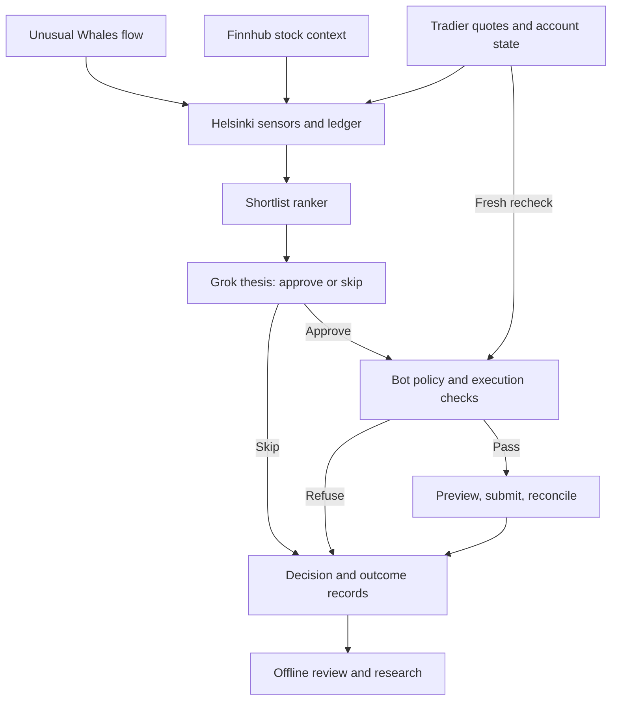

# GrokTrading

GrokTrading supports a **Grok-assisted options trading desk**. It looks for recent
options-flow activity, checks whether the same contract is still available near
the observed price, asks Grok to approve or skip a written trade thesis, and
uses deterministic checks before an order can proceed.

The live search routine is called **Continual15**. This repository contains its
Python building blocks, research tools, and operating documentation. The Bot's
scheduled decision routine and parts of the deployed sensor system are managed
separately; installing this package does not start an autonomous trading bot.

**Status:** alpha reference package. The default is `signals_only`; live trading
is operator-gated. Live orders are never placed by default. There is no verified
profitability claim. This is not financial advice.

[How it works](#how-a-trade-works) · [Implementation status](#what-is-implemented)
· [Current policy](#current-live-card) · [Idea Funnel B](#idea-funnel-b-multi-source)
· [Try it locally](#try-it-locally) · [Documentation](#documentation)

## Idea Funnel B (multi-source)

Locked 2026-09-20 PT (window ~ through 2026-10-04). Ranked ideas from
three sources plus tape. Vendors never autofire. Live mode is
`top_clear_one_lots` only — Tradier one-lots after desk gates. Shadow
may run many ideas in parallel. **Not a profitability claim.**

| Source | Vendor-intended use on this desk |
| --- | --- |
| sit2 / Continual15 + Unusual Whales | Proprietary flow shortlist. Live stays on Helsinki behind `live_order_gate`. |
| Trade Machine | Today board. Trade **Active** only (Near Active is watch). Show Options / OCC, then alerts and ProScan. Trial. |
| Options AI | Fast Trade or Scanner → Compare (max risk, max gain, PoP at mid). Expected Move is 92.5% of the ATM straddle, not a probability. Trial. |

Without Active → resolvable OCC and sandbox paper fills, the paid products
are underused: the desk has about zero Trade Machine paper fills, get-ideas
has not been run on an RTH cadence, Trade Machine OCC is incomplete, Options
AI cards are missing risk/gain/PoP, and alerts / ProScan are unused.
[Underuse gap](docs/UNDERUSE_GAP_20260921.md).

Pipeline: ingest → normalize one card → desk gates → score (multi-source
bonus) → shadow many in parallel → live Tradier top-clear one-lots only.
Full card: [Idea Funnel B](docs/IDEA_FUNNEL_B.md). Product use:
[IDEA_PRODUCT_USE.md](docs/IDEA_PRODUCT_USE.md). Planning-only stack note:
[$25k consult](docs/STACK_25K_YOLO_CONSULT_20260921.md). Schema:
[idea_card v0.1](docs/IDEA_CARD_V0_1.md).

Trade Machine and Options AI boards in this repo are **shadow/paper**.
That label is not an order. Any adapter must require paper/shadow
provenance. `get_ideas.py` is not wired to `live_order_gate`.

**Paper prove-it** is the Tradier sandbox account (`YOUR_SANDBOX_ACCOUNT_ID`
from host env `TRADIER_PAPER_ACCOUNT_ID`) at `https://sandbox.tradier.com/v1`
only. Never `api.tradier.com`. The live production account is not published
here and is not a paper target. In-app Options AI paper is not Tradier paper.
Never auto broker-connect Options AI to the live account.
`tools/tradier_paper/` defaults to dry-run; `--submit` is the only POST, and
it stays on the sandbox. Buy-to-open puts on IWM, SPY, and QQQ stay refused.

Trade Machine trial **prove/kill is Friday 2026-09-25 end of day PT**. Hard
cancel Monday 2026-09-28 if Active → OCC and paper fills are still unproven.

Trade Machine capture: a HAR outside the repo, redact it, then pass that
file explicitly. Options AI ideas come from a validated DOM QuickStrike or
Strategy Builder board. Copy max risk, max gain, and PoP when the DOM shows
them. Chain/quote HAR JSON is not an idea feed.

```bash
node tools/idea_board_scrape/cdp_har_capture.js /tmp/tm_REDACTED.har
python tools/idea_board_scrape/redact_har.py /tmp/tm_REDACTED.har /tmp/tm_REDACTED.har
python tools/idea_board_scrape/get_ideas.py --source both \
  --from-har /tmp/tm_REDACTED.har \
  --from-board evidence/idea_boards/options_ai_20260921_0846_pt.json
python tools/idea_shadow_rank/rank_open_slate.py
```

Do not commit HAR files, tokens, or account numbers. There is no baked-in
default HAR. Playbook:
[tools/idea_board_scrape/PIPELINE.md](tools/idea_board_scrape/PIPELINE.md).

## How a trade works

The working hypothesis is that **recent options flow, supporting evidence, and
an executable price may identify a short-term opportunity**. Flow supplies a
candidate to investigate; it does not prove a trade will be profitable. The
shortlist sorts eligible contracts by recency, not by predicted return.

1. **Observe the market.** The always-on server, **Helsinki**, collects Unusual
   Whales options flow, Finnhub stock activity, and Tradier data. It stores market
   observations in local tapes and a flow ledger. Helsinki runs no LLM and does
   not place orders.
2. **Narrow the candidates.** The Python ranker filters recent flow prints by
   contract, price band, excluded symbols, and supplied session/position facts.
   It produces up to three distinct contracts in `shortlist.json`. Its default
   price band is $0.50–$2.00 per option share; this is separate from entry sizing.
3. **Make a decision.** Continual15 periodically reads the shortlist when it is
   deployed and fresh. The Bot assembles fresh Tradier quotes and other evidence
   for Grok to review. Grok returns **approve or skip**, a thesis, and the facts
   it relied on. Contract, quantity, price, account, and order action belong to
   deterministic execution code. The repo provides this interface and a default
   skip adapter, not the deployed Grok scheduler or model integration.
4. **Check the proposed entry.** Approval is only one input. The package gate
   checks print/quote age, matching ask, session confirmations, prior activity,
   broker positions and working orders, cash reserve, quantity, market hours,
   and the entry cutoff. Missing or stale required evidence blocks new risk.
   The Bot also requires a written thesis and a condition that would invalidate it.
5. **Preview, submit, and reconcile.** The package order state machine previews
   the immutable entry payload, refreshes inputs, reruns the gate, and can submit
   through an explicitly configured broker. An ambiguous response must be
   reconciled by order tag before retrying. An acknowledgment is not a fill.
6. **Manage the position and record the outcome.** The reported Bot process
   monitors the thesis and the trial take-gain rule. Named exits require an exit
   thesis linked to the entry. The 12:30 PT cutoff blocks new entries; existing
   long options may remain overnight. Decisions, refusals, and confirmed fills
   provide evidence for later review.



This is the desk's intended division of responsibility. The ranker needs
operator deployment, and the gate components below require integration.
WebSocket events never directly trigger live orders. Opportunity webhooks
(`sit_match` and `shortlist_opportunity`) remain **KEEP_PAUSED**; `sit_match`
stays OFF. Position/fill notifications serve a separate monitoring role.

## What is implemented

There are **two different gate layers**. `groktrading.gate.evaluate_gate`
validates a candidate against market/account facts. `tools/live_order_gate`
validates the Bot's entry or exit thesis and builds an order form. Calling the
second does not automatically run the first.

| Component | What this repository provides | Boundary or remaining integration |
| --- | --- | --- |
| [Sensors and feeds](src/groktrading/feeds/) | Provider clients, parsers, freshness helpers, and [host companion scripts](deploy/examples/systemd/host-companions/) | Several package CLIs are offline skeletons. Live companions require operator wiring; the existing host tape is separately maintained. |
| [Shortlist](src/groktrading/shortlist.py) | Deterministic filtering, newest-first ranking, and JSON output; default 10-second cadence, configurable within 5–15 seconds | Example timer is not auto-enabled. Missing input produces an empty shortlist. |
| [LLM interface](src/groktrading/llm.py) | Typed approve/skip contract and `StaticSkipLLM` | No bundled live Grok adapter or Continual15 scheduler. |
| [Candidate gate](src/groktrading/gate.py) and [quote checks](src/groktrading/quote_gate.py) | Entry checks using supplied quotes, broker snapshots, and session facts | Callers must fetch current inputs. Entry models are buy-to-open only. |
| [Bot thesis gate](tools/live_order_gate/) | Entry/exit thesis validation, form construction, and audit records | **Dry-run only; never POSTs.** It does not fetch quotes or enforce all candidate-gate checks. Bot HTTP submission is a separate integration. |
| [Order lifecycle](src/groktrading/order_fsm.py) and [Tradier adapter](src/groktrading/brokers/tradier.py) | Preview, final gate, submit, and reconciliation primitives | Can submit through a configured broker. `Executor.maybe_submit` itself only previews after a passing gate. These are not automatically wired to the thesis CLI. |
| [Deployment tooling](docs/DEPLOY.md) | Installer, environment templates, and service examples | Installing files or merging a PR does not update the live Helsinki tree. |

The distinction matters: **“never POSTs” describes `tools/live_order_gate`, not
the entire repository.** The Tradier client contains preview and submit methods.
See [the thesis-gate contract](docs/LIVE_ORDER_GATE.md) and
[execution checks](docs/SAFETY.md) before integrating them.

### Code defaults versus reported desk policy

The operator snapshot and executable defaults differ. Documentation updates do
not configure the running Bot or widen these defaults.

| Setting | Checked-in behavior/default | Operator report, 2026-09-17 PT |
| --- | --- | --- |
| Flow-print freshness | `SIT_MATCH_MAX_AGE_SEC=60`; used by the ranker and live candidate gate | **SOFT 180s**, hard stale above 180 seconds |
| Ask tolerance | `GateContext.matching_ask_tolerance=0` — exact ask by default | **HARD ±$0.02** at decision and submit recheck |
| Other freshness clocks | Quote age 5 seconds; candidate TTL 15 seconds; shortlist document age 30 seconds by default | These are separate from flow-print age and the hunt interval |
| Hunt cadence | No Continual15 scheduler in this package | Five-minute schedule; “15” is a strategy name |
| Take-gain | Bot process; not an automatic exit implementation in the thesis gate | Trial: arm at 1.25× entry, protect 50% of peak gain |
| Symbol exclusions | The shortlist excludes META, NET, MU, AMD, SPCX, and INTC puts | Same desk exclusions; the candidate gate is not a substitute for the ranker |

The ranker cannot recover prints it already discarded under its own freshness
limit. A later 180-second consume policy does not make a 60-second producer
accept older prints. The reported live configuration has not been verified by
this repository. Sources: [models](src/groktrading/models.py),
[policy constants](src/groktrading/policy.py), [print clock](src/groktrading/sit_match.py),
and [operator snapshot](docs/CURRENT_POLICY.md).

## Current live card

**Operator-reported as of 2026-09-17 PT.** The complete dated card is in
[Current desk policy](docs/CURRENT_POLICY.md); host observations are in
[Observed deployment](docs/OBSERVED_DEPLOYMENT.md). These are records of reported
policy, not proof that this commit is deployed.

- **Mandate:** capital expansion (the operator's “YOLO” account). Planning capital
  is **$25,000**; actual Tradier cash/equity controls affordability.
  Planning capital ≠ current broker equity.
- **Entries:** buy to open, quantity one; preserve cash/equity ≥20% and max deploy
  80%. The package checks this on entry. Overnight long options are allowed.
- **Session:** no new entries during 09:30–09:45 ET. The stated Continual15 hunt
  window then runs through 15:00 ET. The separate hard new-entry cutoff is
  **12:30 PT / 15:30 ET**; it does not flatten the book.
- **Exits:** use a named exit thesis and `sell_to_close` for a long option. The
  trial take-gain arms when bid reaches **entry × 1.25** and sets protection at
  **entry + 0.50 × (peak bid − entry)**, ratcheting with the peak. Thesis failure
  or an operator exit can override it. This is a rule under evaluation.
- **Credit/STO:** still refused pending a named I4 review. Naked STO stays refused.
  The [review plan](docs/STO_UNLOCK_PLAN.md) does not itself enable a spread executor.
- **Data and diagnostics:** UW MCP is deferred; opportunity webhooks remain
  paused. Friday+ shadow tags are score-only and do not change live gates.

**Open documentation questions:** the recorded cron
`CRON_TZ=America/New_York` with `*/5 9-15 * * 1-5` fires from 09:00 through 15:55 ET,
so it requires separate session/window checks to match the stated hunt hours.
The I4 source says “Fri 2026-09-19”, but that date is Saturday. The intended
review date needs confirmation; the hold remains in force. Neither ambiguity
is resolved by changing trading behavior in this README.

## Try it locally

Requires **Python 3.11+**. From a checkout:

```bash
git clone https://github.com/darrylsj/groktrading.git
cd groktrading
python3 -m venv .venv
source .venv/bin/activate
python -m pip install -e ".[dev]"
```

Run an offline shortlist example with a deliberately empty input. No credentials,
network calls, model, or broker connection are needed:

```bash
mkdir -p research-runs/readme-demo
python -c 'from pathlib import Path; Path("research-runs/readme-demo/prints.json").write_text("[]\n")'
groktrading-shortlist \
  --prints research-runs/readme-demo/prints.json \
  --out research-runs/readme-demo/shortlist.json
python -m json.tool research-runs/readme-demo/shortlist.json
```

Expect schema `groktrading.shortlist.v1`, `candidates: []`,
`empty_reason: "no_fresh_prints"`, and `emit_sit_match: false`. This exercises the
local data contract, not a market signal. [The ranker guide](docs/REALTIME_PLANES.md)
describes real ledger/tape inputs and timer wiring.

Run the repository checks:

```bash
ruff check src tests scripts tools
pytest
mypy src/groktrading
python scripts/scan_secrets.py
```

`signals_only`, `paper`, and `live` are integration modes; changing a mode is not
a complete trading setup. The default executor records signals without placing
orders. Paper/live callers must explicitly configure their broker and lifecycle.
Keep production pricing evidence separate from sandbox execution artifacts.
For host setup, use [Deploy](docs/DEPLOY.md) or
[Rebuild on a new provider](docs/REBUILD_NEW_PROVIDER.md). The installer defaults
to `/opt/groktrading`; the reported live host uses `/opt/trading-desk`.

## Research and supporting tools

These help evaluate decisions and operations. They do not authorize live trading
or automatically improve the strategy.

| Tool | Purpose and status |
| --- | --- |
| [Opening15](docs/OPENING15_EXPERIMENT.md) | Separate paper experiment covering the opening 15 minutes; not Continual15. Its [decision protocol](docs/OPENING15_DECISION_PROTOCOL.md) defines evaluation criteria. |
| [Research cycle](docs/GROK_RESEARCH_HANDOFF.md) | Evidence capture, Codex CLI selection, outcome resolution, bounded next-day memory, and reviewed prompt versions. A research workflow, not proof the live Bot self-improves. |
| [Strategy factory](docs/STRATEGY_FACTORY.md) | Observational hypothesis ledger: propose, collect evidence, paper, validate, reject/retire. `live_gate=false`; even `live_allow` does not enable `live_order_gate`. |
| [Shadow bets](docs/SHADOW_BETS.md) | Observational study of refused candidates using supplied Tradier marks. `live_gate=false`; labels do not re-enable a webhook or change freshness policy. |
| [GEX shadow](tools/gex_shadow/) | Paired quote study of gamma-exposure ideas; observational only. |
| [Idea board scrape](tools/idea_board_scrape/PIPELINE.md) | HAR → redact → `get_ideas.py` → `idea_board.v0_1` for Trade Machine and Options AI. Shadow/paper only; never live submit. |
| [Idea shadow rank](tools/idea_shadow_rank/README.md) | Ranks those boards. Shadow only. Does not invent prices or Compare metrics. |
| [Tradier paper](tools/tradier_paper/README.md) | Sandbox one-lots at `https://sandbox.tradier.com/v1`. Dry-run unless `--submit`. |
| [Desk board](docs/DASHBOARD.md) | Static decision-funnel and optional read-only health views. [Refresh operations](docs/LIVE_BOARD_REFRESH.md) are separate from trading. |
| [Dual-broker work](docs/DUAL_BROKER.md) | Tradier adapter plus Schwab OAuth helper and fail-closed stub; not a completed second execution venue. |

**Evidence standard:** never invent prices, fills, or P&L. Tests establish behavior
under their fixtures; they do not establish trading edge or deployed health.
Sandbox fills and shadow marks must be labeled separately from confirmed live
fills. Historical anecdotes, including the September 11 QQQ trade, belong in
[dated audit notes](docs/astra_friday_desk_audit_20260911.md), not a performance claim.

## Documentation

| If you want to… | Read |
| --- | --- |
| Understand the strategy and terminology | [Operating model](docs/OPERATING_MODEL.md), [current policy](docs/CURRENT_POLICY.md), [Idea Funnel B](docs/IDEA_FUNNEL_B.md), [product use](docs/IDEA_PRODUCT_USE.md) |
| Trace sensors, ranking, and decisions | [Realtime planes](docs/REALTIME_PLANES.md), [architecture](docs/ARCHITECTURE.md), [WebSockets and webhooks](docs/WEBSOCKETS.md) |
| Review order checks and exits | [Safety](docs/SAFETY.md), [thesis gate](docs/LIVE_ORDER_GATE.md), [I4 review plan](docs/STO_UNLOCK_PLAN.md) |
| Understand provider roles | [API matrix](docs/API_MATRIX.md): UW for flow, Finnhub for stock context, Tradier production for option quotes and broker state. Finnhub stock ticks are not option NBBO. |
| Deploy or rebuild | [Deploy](docs/DEPLOY.md), [new-provider rebuild](docs/REBUILD_NEW_PROVIDER.md), [observed host](docs/OBSERVED_DEPLOYMENT.md), [examples](deploy/examples/) |
| Compare a deployed fingerprint to git HEAD | [Deployed-vs-HEAD drift](docs/DEPLOYED_HEAD_DRIFT.md) (read-only; no SSH) |
| Find evidence and retention rules | [Logs](docs/LOGS.md), [trade journal](logs/trades.jsonl), [Box archive](docs/BOX_ARCHIVE.md), [changelog](CHANGELOG.md) |
| Conduct an external audit | [OpenAI brief](docs/OPENAI_AUDIT_BRIEF.md), [Claude brief](docs/CLAUDE_AUDIT.md), [passive reviewer](docs/REVIEWER.md) |

Use code to establish package behavior, the dated policy card for operator intent,
and deployment records for host observations. Older dated audits describe the
system they reviewed; they do not override a later policy snapshot.

**Glossary:** an **OCC** identifies an option contract; **NBBO** is the national
best bid and offer; **BTO/STC/STO** mean buy to open / sell to close / sell to open.
**Sit-2 (I2)** is the two-confirmation entry path; **I1** also labels the
`must_trade_small` exception, which bypasses only the sit-2 count check in the
candidate gate. **I4** is the proposed defined-risk credit-spread experiment.
**RTH** means regular trading hours; **PT/ET** mean US Pacific/Eastern time.

## License

[MIT](LICENSE). No warranty or promised investment return.
