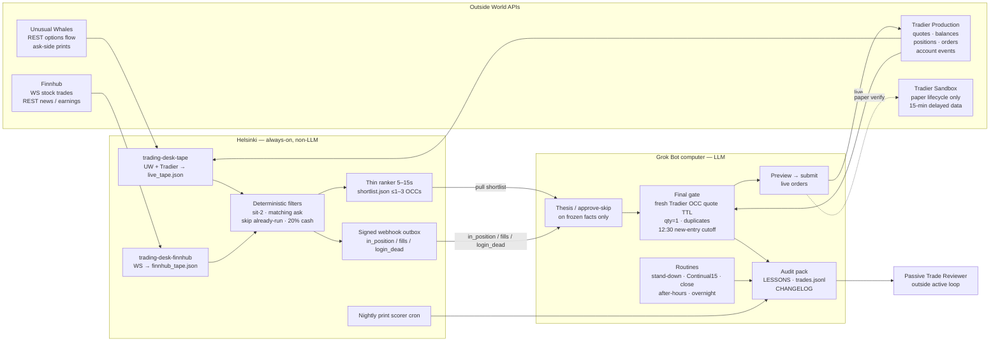

# GrokTrading

**Public reference package** intended for **external audit** (including OpenAI review under `darrylsj`). This is **not financial advice**. Secret-free **reference and deployment package** for a Helsinki-hosted, Grok-assisted options desk. **Helsinki** is always-on sensors (no LLM, no order router). **Grok Bot** decides. Default mode is **signals-only**. Paper is explicit. **Live orders are never placed by default.** Live trading is **operator-gated**. Merge ≠ Helsinki restart.

This software does **not** promise trading success. It must **not** invent prices or P&L. Host observations are ops context, not a claim this commit is deployed. See [docs/OBSERVED_DEPLOYMENT.md](docs/OBSERVED_DEPLOYMENT.md).

## Current live card (authoritative)

As of **PR #35 on `main`** (2026-09-11/12). Encoded cutoff and session labels use **PT**. Host trading routines use **`CRON_TZ=America/New_York`**. Any older ≥50% cash floor, flatten-at-12:30, or no-overnight policy in this tree is stale.

- **Overnight long options: ALLOWED**
- **12:30 PT = NEW-ENTRY CUTOFF ONLY** (15:30 ET; not a forced flatten). Fail-closed = no new risk; continue monitoring existing positions
- **Cash/equity ≥20%** at all times as a pre-entry reserve / **max deploy 80%**
- **One-lot preference (~$200)** — no hard concurrent-position caps, no daily-loser circuit breaker
- **Entry is BTO-only**; named exits may **sell_to_close** via `tools/live_order_gate` (dry-run / audit). **No raw POST** from this package
- **Live orders must NEVER be triggered by WebSocket alone**; final gates recheck fresh Tradier **production** quotes
- **Grok/LLM is outside the broker execution boundary**: approve/skip on frozen facts only; never set OCC, qty, limit, account, or order action
- **Take-gain is TRIAL** — arm +40% / keep 50% of peak; **n=1** Fri `QQQ260911P00717000`. Do **not** lock
- **Open stand-down only 9:30–9:45 ET**, then hunt. Close card **16:00 ET** (= 1:00 PM PT). Close is a card, not a flatten machine

**Friday 2026-09-11 book (operator-stated; not in `logs/trades.jsonl`):** open $421.74 → close flat $460.56. Sole live lot `QQQ260911P00717000` BTO 1.06 → STC 1.45; Tradier `close_pl` +$39. n=1. Do not treat as expectancy.

OpenAI P0.4 flatten-everything / no-overnight is **rejected**. Checklist: [docs/SAFETY.md](docs/SAFETY.md). Gate: [docs/LIVE_ORDER_GATE.md](docs/LIVE_ORDER_GATE.md).

## Three-plane realtime desk

**This is the realtime design.** It replaces webhook→LLM `sit_match` firehose. Full write-up: [docs/REALTIME_PLANES.md](docs/REALTIME_PLANES.md). Audit: [docs/astra_realtime_planes_audit_20260912.md](docs/astra_realtime_planes_audit_20260912.md).

| Plane | Who | Cadence | LLM? |
| --- | --- | --- | --- |
| **1 Hot sensor** | Helsinki UW / Finnhub / Tradier → ledger/tape | Continuous | No |
| **2 Thin ranker** | `groktrading.shortlist` → `shortlist.json` (≤1–3 OCCs) | **5–15s** (default 10) | No |
| **3 Decision** | **Continual15** + fresh Tradier quotes → thesis → `live_order_gate` | Rolling 15-minute RTH looks | Grok on frozen facts |

Rate-limit **candidates**, not the tape. No per-print Grok wake. Host path (ops docs, **not** a deploy claim): `/opt/trading-desk/state/shortlist.json`. Example timer: `deploy/examples/systemd/shortlist-ranker/` — **not auto-enabled.** Merge ≠ Helsinki restart.

`SIT_MATCH_MAX_AGE_SEC=60` is **print freshness (I1)**. Do **not** raise it to match any producer interval. `SIT_MATCH_MIN_INTERVAL_SEC` (package 60; Host Mon prep **300**) is a **Cursor wake bandage**, not the trading latency target and **not the realtime design**. Hunt must not depend on it. Prefer `SIT_MATCH_WEBHOOK` **off** for hunt; optional rare alert only. Webhooks stay for `in_position` / fills / `login_dead`.

Until the ranker file is actually refreshing on the host, Monday hunt is **Continual15-only**. Weekend sit_match mute may stay; open-card unmute is optional.

## Decision loop: Continual15 (live hunt)

**Live hunt is Continual15** — plane 3. Rolling 15-minute RTH looks **after** the 9:30–9:45 ET open stand-down, through **15:00 ET** (before the 12:30 PT / 15:30 ET new-entry cutoff). Pull shortlist + fresh Tradier quotes when that file is live; otherwise hunt without the sit_match bus. Grok decides on frozen facts. Helsinki does not.

**Opening15** (first-15-minute / ten-stock, Tuesday 2026-09-08 paper pilot) is **research-only**. It is **not** the live strategy. Capture/monitor/report stay quote-only; **no broker order path**. Protocol: [Opening15 decision protocol](docs/OPENING15_DECISION_PROTOCOL.md). Paper runbook: [Opening15 experiment](docs/OPENING15_EXPERIMENT.md). Tuesday readiness notes stay paper: [Tuesday execution readiness](docs/TUESDAY_EXECUTION_READINESS.md).

## live_order_gate (entry + exit)

In-repo source of truth: `tools/live_order_gate`. **This package never POSTs** (P0). Dry-run form + audit only. The Bot / operator HTTP client is a separate step. **PR #35** ported Friday’s STC exit path into git. Package `evaluate_gate` / `OrderPayload.side` remain **BTO-only** so the FSM does not grow a credit type.

| Path | Side | Notes |
| --- | --- | --- |
| Entry | `buy_to_open` only | Thesis required; 12:30 PT cutoff; cash debit; exact-side credit/STO ban; alphanumeric tag; same-PT-session + 8h thesis TTL |
| Exit | `sell_to_close` / `buy_to_close` | Only named strategies: `take_gain_exit`, `dead_thesis_exit`, `falsifier_exit`, `stop_exit`, `manual_exit`, `time_stop_exit`. Skip cutoff + cash debit. `parent_signal_id` required. Thesis required |

Closes go through `live_order_gate`, not `Executor.maybe_submit`. Details: [docs/LIVE_ORDER_GATE.md](docs/LIVE_ORDER_GATE.md).

Optional green-week (2026-09-12) add-ons — **not live gates**: overnight
carry notes on `write-thesis` (`--overnight-carry` requires DTE / event risk /
rationale; `how_it_dies` still required); shadow GEX 60-minute paired scorer
in [`tools/gex_shadow`](tools/gex_shadow) (`live_gate=false`; never invents
marks). Helsinki **shortlist deploy is operator-side**. Note:
[docs/GREEN_WEEK_OPTIONAL_20260912.md](docs/GREEN_WEEK_OPTIONAL_20260912.md).

## Helsinki sit_match (deprecated as hunt bus)

Helsinki is an **exchange-grade sensor farm + append-only research DB**. It is **always-on listen** with API keys on the host. It is **not** a decision engine and it is **not** an order router. Plane 1 writes the tape; plane 2 ranks; **Grok Bot only** decides.

| Role | Who |
| --- | --- |
| Listen / normalize / freshness / filter / ledger | **Helsinki** (no LLM) |
| Thin shortlist (≤1–3 OCCs, 5–15s) | **Helsinki ranker** (no LLM) — package helper, host-wired |
| Decide / place orders | **Grok Bot only** |

`sit_match` POSTs are **deprecated as the hunt bus** (PR #34 stopped the firehose; it did not become the realtime design). Prefer `SIT_MATCH_WEBHOOK` **off** for hunt. Optional rare alert mode only. Weekend-muted on the host is fine; open-card unmute is optional.

**Freshness (I1, still 60s):** UW `option-trades` `executed_at` age ≤ `SIT_MATCH_MAX_AGE_SEC` (default **60s**). Do **not** raise this to match `SIT_MATCH_MIN_INTERVAL_SEC`. `created_at` / `timestamp` / inbound `print_age_sec` are **not** the execution clock. `print_age_sec` is overwritten from `executed_at` at POST. Re-check immediately before HTTP (`sit_match_stale_at_post`); stamp `emitted_at`. **OCC-only** debounce (not per OCC\|`executed_at`). Mute: `SIT_MATCH_WEBHOOK=0` and/or mute file `/opt/trading-desk/state/sit_match_webhook_muted` → `sit_match_webhook_muted`. Call `prepare_sit_match_outbound` on the host tape (`ws_tape.py`) at POST, not at detect. Inbox + I1 still refuse stale `executed_at` at consume.

| Knob | Package default (this tree) | Host ops fact | Hunt role |
| --- | --- | --- | --- |
| `SIT_MATCH_MIN_INTERVAL_SEC` | **60** | **300** (Mon prep bandage) | **Not** trading latency. Hunt must not depend on it |
| `SIT_MATCH_MAX_AGE_SEC` | **60** (inbox + I1 + ranker print clock) | **60** | Print freshness. Do **not** raise to match producer |
| `SIT_MATCH_WEBHOOK` | unset = optional producer may emit unless muted | Weekend-muted | Hunt default **off** |
| Ranker cadence | 10s (clamp 5–15) | Not claimed deployed | Plane 2 |

Package default may still differ until the host copies this tree. **Merge ≠ Helsinki restart.** Do not claim this commit is live on `/opt/trading-desk`.

**Mon hunt posture:** 300s producer ∩ 60s consume is **near-empty**. That is why 300s is not the design. Hunt is **Continual15** (+ shortlist when the host file is live). Reserve webhooks for **`in_position` / fills / working-order / `login_dead`**. Do not “fix” emptiness by widening consume age.

Host contract (rare alert): `deploy/examples/helsinki/ws_tape_sit_match.py`. Simulate: `scripts/simulate_sit_match_webhook.py` (local 127.0.0.1 only; does not read `grok-webhook.env`). Non-finite limits (`inf` / `NaN`) fail closed. Package: `groktrading.sit_match`. Ledger may still **store** stale or clock-less prints for research (`groktrading.flow_ledger`); freshness-sensitive use fail-closes.

## Clocks

| Clock | Zone | Meaning |
| --- | --- | --- |
| Host trading routines | **`CRON_TZ=America/New_York`** | Travel-proof. Open card 09:00 ET (not hunt). Continual15 after stand-down through 15:00 ET. Close card **16:00 ET** (= 1:00 PM PT). AH 16:06 ET |
| Open stand-down | ET | **Only 9:30–9:45 ET**, then hunt. Do not lift at 09:00 ET |
| Encoded new-entry cutoff | **12:30 America/Los_Angeles** | Authoritative for new BTO in `evaluate_gate` / `live_order_gate`. 12:30 PT = 15:30 ET |
| Repo example crons / installer docs | often `America/Los_Angeles` | **Docs ≠ host.** Do not copy example crons onto trading routines without stating `CRON_TZ` and city |

Friday’s close card wrongly fired at 13:00 America/Toronto (mid-RTH). Default host TZ is how that happened. Any new cron or close card must state `CRON_TZ` and city.

## Operator mandate (YOLO — capital expansion)

This is Darryl’s **YOLO account**. The goal is **capital expansion**, not capital preservation. Do **not** frame the desk as a “don’t lose” or preservation book.

| Frame | Meaning |
| --- | --- |
| **Planning / selection / multi-lift sizing** | **$25,000** desk capital |
| **Live Tradier fills** | May still be **cash-constrained** on a **smaller funded balance** until the $25k is deposited |
| **Do not confuse** | Planning capital ≠ current broker equity. Auditors must not assume the live book already holds $25k. |

**Milestone spirit:** grow aggressively within the live-card risk rails (cash/equity ≥20% / max deploy 80%, overnight OK, 12:30 PT = new-entry cutoff only). Encoded gate math stays **one-lot** (`qty == 1`); $25k is the planning frame, not a claim that the funded account is already $25k.

**Historical note (not the primary frame):** the live funded book started small (early operator notes used on the order of hundreds of dollars; first milestone $1,000, then $10,000). Planning capital is **$25k**.

## Auditor links

- **Safety:** [docs/SAFETY.md](docs/SAFETY.md)
- **WebSockets:** [docs/WEBSOCKETS.md](docs/WEBSOCKETS.md)
- **live_order_gate:** [docs/LIVE_ORDER_GATE.md](docs/LIVE_ORDER_GATE.md)
- **Green-week optional (2026-09-12):** [docs/GREEN_WEEK_OPTIONAL_20260912.md](docs/GREEN_WEEK_OPTIONAL_20260912.md)
- **Friday desk audit:** [docs/astra_friday_desk_audit_20260911.md](docs/astra_friday_desk_audit_20260911.md)
- **Realtime planes:** [docs/REALTIME_PLANES.md](docs/REALTIME_PLANES.md)
- **Planes audit:** [docs/astra_realtime_planes_audit_20260912.md](docs/astra_realtime_planes_audit_20260912.md)
- **Architecture:** [docs/ARCHITECTURE.md](docs/ARCHITECTURE.md)
- Also: [docs/OPENAI_AUDIT_BRIEF.md](docs/OPENAI_AUDIT_BRIEF.md) · [docs/CLAUDE_AUDIT.md](docs/CLAUDE_AUDIT.md) · [docs/OBSERVED_DEPLOYMENT.md](docs/OBSERVED_DEPLOYMENT.md)

## Architecture


**Outside APIs** supply Unusual Whales options flow, Finnhub stock trades and news, and Tradier production quotes, balances, positions, orders, and account events; Tradier sandbox is paper-lifecycle only (15-minute delayed data). **Helsinki** is always-on and non-LLM (planes 1–2): `trading-desk-tape` and `trading-desk-finnhub` write tape JSON continuously; a thin ranker may emit `shortlist.json` every 5–15s (≤1–3 OCCs; **not auto-deployed**); deterministic filters apply sit-2 / matching ask / skip already-run / 20% cash reserve; signed webhooks are reserved for `in_position` / fills / `login_dead` (not the hunt bus). The **Grok Bot** (plane 3, **Continual15**) writes thesis / approve-skip on **frozen facts**, then a deterministic final gate (fresh Tradier OCC quote TTL, quantity 1, duplicates, 12:30 new-entry cutoff) before preview → submit. Routines and the audit pack (`LESSONS`, `trades.jsonl`, `CHANGELOG`) stay local. The **Passive Reviewer** reads that audit pack **outside** the active loop and has no control or order permissions.

**Hard rules**

- **Finnhub ≠ option NBBO.** Do not gate option limit prices on Finnhub ticks.
- **WebSocket never places orders.**
- Matching ask uses a **Tradier production** quote.
- Maintain **≥20% cash/equity** (max deploy 80%). Overnight longs allowed.
- **12:30 PT** new-entry cutoff only (America/Los_Angeles). Not a flatten.
- **Sandbox ≠ live fill evidence.** Production NBBO is pricing truth.

Legend and the same chart: [docs/ARCHITECTURE_DIAGRAM.md](docs/ARCHITECTURE_DIAGRAM.md). Longer write-up: [docs/ARCHITECTURE.md](docs/ARCHITECTURE.md). WebSocket / webhook sequence (print → filter → webhook → Grok → gate → preview→submit): [docs/WEBSOCKETS.md](docs/WEBSOCKETS.md).



Helsinki **ingests**, **normalizes**, enforces **freshness**, **filters**, optionally ranks a shortlist, and keeps **paper/live env files separate**. Units are **systemd** with **0600** env files. There is **no LLM on Helsinki** and **no per-print Grok wake**. The **LLM thesis / approve-skip** path (Continual15) works on **frozen facts only** and must not call Tradier. The **deterministic final gate / preview→submit executor** on the Grok Bot computer **does** use Tradier production for fresh OCC quotes and live orders. The **passive reviewer** is outside the runtime loop ([docs/REVIEWER.md](docs/REVIEWER.md)). Webhook outbox is **not** the hunt bus.

## Helsinki vs this package

As of **PR #35 on `main`** (package truth). Not a claim this commit is deployed. **Merge ≠ Helsinki restart.**

| | Live Helsinki (ops context) | This package |
| --- | --- | --- |
| Tree | Hand-built `/opt/trading-desk` (no `.git`) | Git repo; installer default `/opt/groktrading` |
| Units | `trading-desk-tape.service` (`ws_tape.py`) + `trading-desk-finnhub.service` | Example `groktrading-*.service` |
| Orders | **No** preview→submit. Webhooks: `sit_match`, `in_position`, `cash_up` (`entry_cutoff_only_no_flatten`), `day_win_target` (`auto_flatten: false`) | Stub-safe `OrderMachine` (BTO) + dry-run `live_order_gate` (BTO entry / named STC exits) on the Grok consumer side |
| `sit_match` interval | Host Mon prep **300s** (weekend-muted; bandage, not hunt) | Default `SIT_MATCH_MIN_INTERVAL_SEC` **60** |
| Other webhooks | In-memory debounce ~90s (weekend same-digest spam) | SQLite WAL inbox/outbox + AH/weekend digest coalesce |
| Trading clocks | Host routines **`CRON_TZ=America/New_York`** | Encoded cutoff 12:30 PT; example crons often `America/Los_Angeles` |

Package hardening ships here first. Copy debounce/idempotency/`live_order_gate` onto the host only after an **operator-authorized** restart. **Grok Update Computer does not rebuild Helsinki.**

## Helsinki sensor farm

Hot research window is SQLite / day packs on limited disk (**7–14 days**). Cold history is **Box Trading Desk Archive** (`daily/YYYY-MM-DD/…`, no secrets).

- **No LLM on Helsinki.** No 10k-universe spray. **WebSocket → orders is forbidden.**
- **P0 (merged):** append-only `flow_ledger`, Tradier **account-events**
  position-truth helper, Box cold-rotate, `sit_match` freshness (#24/#25),
  POST-time `print_age_sec` overwrite + mute + interval (#34),
  `live_order_gate` STC (#35).
- **P1/P2 (this package):** helpers only — UW **flow-alerts** poller (emit on
  **new alert id**), tide + optional net-prem `tide_state.json`, bounded Tradier quote
  interest, thin RTH screener snapshot, shadow minute-marks, `UW_WS_URL`
  probe stub, Finnhub watch widen + overnight news, replay scorecard
  skeleton. Package CLIs stay **offline skeletons**.
- **Host companions (repo artifacts, operator-wired):** live **urllib**
  pollers matching Helsinki 2026-09-08 under `scripts/` (`helsinki_http.py`
  `UrllibHttp` — not httpx; `flow_ledger_companion.py`,
  `flow_alerts_companion.py`, `tide_companion.py`, `screener_companion.py`,
  `quote_interest_companion.py`) plus example units in
  `deploy/examples/systemd/host-companions/`. Example units use
  **`User=tradingdesk`** (not root) and omit webhook env on units that
  never emit webhooks. urllib GETs do not follow redirects (Authorization
  is not re-sent). **`install_helsinki.sh` does not copy, enable, or start
  them.** **emit_sit_match=False.** Flow-alerts material is local JSONL
  only (no Grok webhook). Authorization Bearer is runtime env only. Not a
  claim these processes are live on Helsinki.
- **Account-events WS** (`wss://ws.tradier.com`): **position truth** only —
  fills/cancels keep `in_position` honest after flatten. Never a submit path.
  Package helper: `groktrading.feeds.account_events`. Example unit
  `groktrading-account-events.service` is **files only** (not enabled by
  `install_helsinki.sh`). Do **not** auto-start it.
- **Box cold-rotate:** `scripts/box_cold_rotate.py` + [docs/BOX_ARCHIVE.md](docs/BOX_ARCHIVE.md).
  Deny-list blocks `.env` / tokens / credentials, **symlinks**, paths
  outside the archive root, and non-export suffixes. Delete only after
  verified upload or `--confirm-delete`.
- **Hot retention:** `scripts/hot_ledger_retain.py` purges `uw_flow.sqlite`
  after a verified Box export (7–14 day window) and bounds companion JSONL.
  Example timer/cron under `deploy/examples/systemd/hot-retention/` — do
  **not** enable from this repo. Replay scorecard counts are **not**
  performance evidence.
- **Recovery:** SSH + systemd on the host. **Merging this repo does not
  deploy Helsinki** and does **not** restart live units. After merge, an
  operator must copy helpers into the live tape if needed and **wire companion units
  separately** (copy `deploy/examples/systemd/host-companions/`
  yourself). `ws_tape.py` stays host-owned. Account-events stays **files-only /
  disabled**. **Merge ≠ Helsinki restart.**

## What this is

A typed Python package under `src/groktrading` with:

- Finnhub stock-trade WebSocket helpers (reconnect/backoff, bounded watchlist, atomic redacted JSON, freshness/health, REST probe)
- Generic Unusual Whales and Tradier clients (timeouts and stale data **fail closed**, dependency injection)
- Candidate + deterministic gate (sit-2, matching ask, already-run, no first-red, TTL, ≥20% cash reserve, quantity 1, broker-authoritative duplicates, clock, 12:30 PT entry-cutoff)
- Production quote gate (OCC, delayed, provider bid/ask dates, spread, no-chase; sandbox/synthetic cannot pass live)
- Preview→submit order state machine (immutable payload, no blind retry; stub-safe; BTO-only payload)
- Dry-run `tools/live_order_gate` (BTO entry + named STC/BTC exits; **never POSTs**)
- Signed webhook sender plus durable SQLite WAL inbox/outbox idempotency (AH/weekend digest coalesce)
- LLM interface: **approve/skip + thesis** from assembled facts only; **no broker access**; never sets OCC/qty/limit/account/order action
- Signals-only executor stub and explicit live gating (WebSocket cannot submit live)
- Paper recorder/reconciler (production NBBO truth vs sandbox delayed fills, `signal_id`, preview-before-order, same-session paper file)
- 12:30 PT new-entry cutoff policy (not a forced flatten; overnight long options allowed; alert if cutoff cancel fails)
- systemd/env **examples**, portable host installer (`scripts/install_helsinki.sh`), JSON Schema, CI, tests

## Persistent logs

Secret-free, append-only records. Rules: [docs/LOGS.md](docs/LOGS.md).

| Path | Role |
| --- | --- |
| [CHANGELOG.md](CHANGELOG.md) | Development log (Keep a Changelog; America/Los_Angeles dates) |
| [logs/trades.jsonl](logs/trades.jsonl) | Live trade journal (one JSON object per round-trip; open lot allowed) |

`thinking.jsonl` is the mixed decision tape on the host. It is **not** committed and is **not** a substitute for either file above. Friday’s QQQ lot is **not** journaled here. n=3 is not an edge. Never commit secrets.

## What this is not

- A claim that Helsinki already runs **this** commit
- A Backtrader/LEAN/Lumibot application (see research notes below)
- A place for API tokens, webhook secrets, or host IPs
- A claim that Opening15 is the live hunt (that is Continual15)

## Operating modes

| Mode | Default | Orders |
| --- | --- | --- |
| `signals_only` | Yes | Never |
| `paper` | No | Tradier sandbox after preview + gate |
| `live` | No | Requires explicit enablement; **still blocked** from WebSocket callbacks |

Live policy encoded in the gate: **one-lot options**, **sit-2**, **matching ask**, **skip already-run**, **no first-red**, **no spray**, cash/equity **≥20%** at all times (max deploy 80%), **overnight long options allowed**, **12:30 PT new-entry cutoff only** (not a forced flatten). The final gate rechecks a **fresh Tradier production option quote** (provider timestamps, OCC, delayed flag), TTL, matching ask, buying power/cash/reserve, quantity **exactly 1**, duplicate/working/in-position from the broker snapshot, market hours, and the 12:30 new-entry cutoff. Candidate booleans cannot pass live alone. Live **closes** use `live_order_gate` named exits, not a raw POST.

## API roles and limitations

### Finnhub

- **REST** (plan-entitled): quote, news, earnings, fundamentals, sentiment — `https://finnhub.io/api/v1`.
- **WebSocket**: `wss://ws.finnhub.io` for **stock trades / last prints**.
- **Finnhub does not provide option NBBO.** Do not gate option limit prices on Finnhub ticks.
- **Plan limits vary.** Missing entitlements fail closed; do not fabricate series.

Docs: https://finnhub.io/docs/api

### Unusual Whales

- Live **options flow / option-trades** and published **ask-side, premium, volume, OI** fields.
- **Configurable base URL** (default `https://api.unusualwhales.com`).
- Docs: https://api.unusualwhales.com/ and https://unusualwhales.com/skill.md
- This repo does **not** invent extra endpoint paths. Operators pass documented paths into the generic client.

### Tradier

| | Production | Sandbox |
| --- | --- | --- |
| REST | `https://api.tradier.com/v1/` | `https://sandbox.tradier.com/v1/` |
| Market stream | `https://stream.tradier.com/v1/` | **None** (no delayed MD stream) |
| Account events | `wss://ws.tradier.com` | `wss://sandbox-ws.tradier.com` |

Surfaces used conceptually: **quotes, chains, balances, positions, orders, preview, clock, account events**.

Opening15 macro VIX is requested as **`VIX`**, then **`I:VIX`**, then **`$VIX.X`**. Coverage is available only when Tradier returns one of those; the collector does not invent an index print. Sandbox has **no indices**.

Sandbox (official market-data / FAQ docs): **~15-minute delayed** data, **no market-data stream**, **no Greeks**, **no indices**, **no tick timesales**; **account-event streaming is available**. **Production NBBO is pricing truth.**

Docs: https://docs.tradier.com/docs/endpoints

### Grok

Thesis and **approve/skip** from assembled facts only. Never invent market data. The LLM must not hold broker credentials or call Tradier. Fresh OCC quotes and live orders go through the **deterministic gate / executor**, which **does** call Tradier production. Submit/close policy for the Bot is `tools/live_order_gate` (dry-run here).

## Install and test

```bash
python3 -m venv .venv
source .venv/bin/activate
pip install -e ".[dev]"
ruff check src tests scripts
pytest
mypy src/groktrading
python scripts/scan_secrets.py
```

## Rebuild / new host

Portable, secret-free host install (new VPS or parallel rebuild next to live Helsinki): **[docs/DEPLOY.md](docs/DEPLOY.md)**. Different-provider full rebuild (copy secrets by key name, recreate units/crons, cutover): **[docs/REBUILD_NEW_PROVIDER.md](docs/REBUILD_NEW_PROVIDER.md)**.

```bash
# files only — no enable, no start, no secrets, no live trading
sudo ./scripts/install_helsinki.sh --dry-run
sudo ./scripts/install_helsinki.sh
```

Defaults: `INSTALL_ROOT=/opt/groktrading` (not legacy `/opt/trading-desk`), package-named units `groktrading-*.service` (not `trading-desk-*.service`), `signals_only`. Merging this repo still does **not** mean Helsinki runs this commit.

## Deployment examples vs observed host

- Copy-paste units and env **templates**: [deploy/examples](deploy/examples) (placeholders only; **root-only 0600** — see `PERMISSIONS.md`).
- **Observed** Helsinki units (`trading-desk-finnhub.service`, `trading-desk-tape.service`, env paths, validated Finnhub WS/REST, successful webhook test): [docs/OBSERVED_DEPLOYMENT.md](docs/OBSERVED_DEPLOYMENT.md).
- Merging Finnhub tape into the existing Tradier/UW `live_tape.json` is an **explicit remaining deployment step**.
- **Do not** restart Helsinki from a cloud agent.

## Package layout

| Path | Role |
| --- | --- |
| `src/groktrading/feeds/finnhub.py` | WS parse, backoff, watchlist, health, REST probe |
| `src/groktrading/feeds/unusual_whales.py` | Generic UW GET |
| `src/groktrading/feeds/tradier.py` | Generic Tradier quotes/balances/clock/preview |
| `src/groktrading/brokers/` | Venue-aware `Broker` protocol; `TradierBroker`; Schwab OAuth helper + fail-closed stub |
| `docs/DUAL_BROKER.md` | Dual-broker plan (OAuth helper; no dual-fire; exits follow holding venue; Tue Opening15 untouched) |
| `src/groktrading/gate.py` | Deterministic final gate |
| `src/groktrading/quote_gate.py` | P0.1 production quote validation |
| `src/groktrading/order_fsm.py` | P0.3 preview→submit lifecycle |
| `src/groktrading/idempotency.py` | Durable inbox/outbox (SQLite WAL) |
| `src/groktrading/flow_ledger.py` | Append-only UW flow ledger (SQLite); sit_match emit stays fail-closed |
| `src/groktrading/feeds/flow_alerts.py` | P1 UW flow-alerts poller; emit on new alert id only |
| `src/groktrading/feeds/tide_state.py` | P1 market-tide + optional net-prem → `tide_state.json` |
| `src/groktrading/feeds/quote_subscribe.py` | P1 bounded Tradier quote interest; `ws_tape.py` is host-owned |
| `src/groktrading/shortlist.py` | Plane 2 thin ranker; `shortlist.json` ≤1–3 OCCs; no sit_match; no LLM |
| `scripts/shortlist_ranker.py` | Ranker CLI (offline-safe). Host path `/opt/trading-desk/state/shortlist.json` is docs, not auto-deploy |
| `src/groktrading/feeds/screener_snapshot.py` | P1 thin RTH screener snapshot; no sit_match spray |
| `src/groktrading/feeds/shadow_marks.py` | P2 shadow minute-marks (quotes only; no orders) |
| `src/groktrading/feeds/uw_ws.py` | P2 `UW_WS_URL` probe stub; fail-closed if unset; no invented protocol |
| `src/groktrading/replay_scorecard.py` | P2 ledger replay counts (first-print / already-run / stale); no PnL |
| `scripts/*_companion.py` | Host live pollers (secret-free). Operator-wired; not auto-enabled |
| `deploy/examples/systemd/host-companions/` | Example companion units + replay-scorecard timer (not installer-managed) |
| `src/groktrading/feeds/account_events.py` | Tradier account-events parse/backoff; position truth; never orders |
| `src/groktrading/box_rotate.py` | Box cold-rotate deny-list + 7–14d keep-hot + delete guard |
| `src/groktrading/retention.py` | Verified hot-ledger purge + companion JSONL bound |
| `scripts/hot_ledger_retain.py` | Operator retain CLI (examples only; no live timer enable) |
| `src/groktrading/webhook.py` | HMAC + durable or in-memory idempotency |
| `docs/WEBSOCKETS.md` | Auditor WS/webhook map (Finnhub ≠ option NBBO; WS never orders) |
| `docs/BOX_ARCHIVE.md` | Hot ledger vs Box `daily/YYYY-MM-DD/` cold archive |
| `docs/OPENAI_AUDIT_BRIEF.md` | What to review / what not to change / $25k YOLO ask |
| `docs/CLAUDE_AUDIT.md` | External Claude audit: live card, Opening15 paper path, APIs, local tests |
| `src/groktrading/llm.py` | Decision protocol (approve/skip only) |
| `src/groktrading/executor.py` | Signals-only stub + live guards |
| `src/groktrading/paper.py` | Paper ledger |
| `src/groktrading/policy.py` | Live card + 12:30 PT entry-cutoff |
| `tools/live_order_gate/` | Bot submit/close policy: BTO entry fail-closed; STC/BTC exits. Dry-run; never POSTs. Optional overnight-carry thesis notes (soft). [LIVE_ORDER_GATE.md](docs/LIVE_ORDER_GATE.md) |
| `tools/gex_shadow/` | Shadow GEX 60-minute ask→bid pair scorer. `live_gate=false`. Never invents marks. |
| `docs/GREEN_WEEK_OPTIONAL_20260912.md` | Weekend optional tools pointer; Helsinki shortlist deploy is operator-side |
| `docs/REALTIME_PLANES.md` | Three-plane hunt SoT (hot sensor / ranker / Continual15) |
| `docs/astra_realtime_planes_audit_20260912.md` | Astra A–F on planes vs 300s sit_match |
| `docs/astra_friday_desk_audit_20260911.md` | Fri 2026-09-11 process vs outcome; Mon refuse list |
| `schemas/` | JSON Schema for tape/gate/LLM artifacts |

## Hardening (package-first)

Safety details: [docs/SAFETY.md](docs/SAFETY.md).

- **P0.1** Quote freshness: OCC after normalize; `delayed==false`; ask>0; bid≥0; bid≤ask; provider `bid_date`/`ask_date` age; reject future timestamps; max spread; no-chase; sandbox/synthetic cannot pass live.
- **P0.2** Final gate: sit / already-run / duplicate / position from durable session facts + fresh broker account/positions/orders/clock. Qty=1. Cash floor ≥20%. No WS-direct submit.
- **P0.3** Order FSM: `RECEIVED → … → PREVIEW → FINAL_GATE → SUBMIT → ACK → FILLED/REJECTED → FLAT_RECONCILED`. Immutable payload; never blind-retry (query Tradier by `tag=signal_id` first). Paper/stub modes need no credentials.
- **P0.4 rewritten** Entry-cutoff only. **Reject** flatten-everything / no-overnight.
- **P0 no raw POST** `tools/live_order_gate` is dry-run / audit only.
- **Idempotency** Durable SQLite WAL inbox/outbox; weekend/AH digest coalesce.

**Measurement:** freeze strategy params except safety; keep selection / execution / risk separate; **n=3 live days ≠ edge**. Do not invent fills or claim profitability. Take-gain remains **TRIAL n=1**.

## Optional research references (not dependencies)

Do **not** add these to `pyproject.toml`. Licensing and product fit are the operator’s problem:

- **LEAN** (QuantConnect) — official Tradier plugin, **Apache-2.0**; preview/submit shape is a **design reference only**.
- **NautilusTrader** — reconciliation / lifecycle concepts; design reference only. Not the runtime.
- **Lumibot** — Tradier support; **GPL** — do not vendor into this tree.
- **Optopsy** — useful options studies if isolated; **AGPL** — do not import.
- **QuantLib / vollib** — pricing research; optional, not required here.
- **Backtrader** — **not used** (avoid GPL entanglement and the wrong execution model).

This package is **not** a LEAN/C#/Nautilus/Lumibot/Optopsy migration.

## License

MIT — appropriate for a **public** GitHub reference package. Still: no warranty, no performance claims, no financial advice, no live trading by default.
