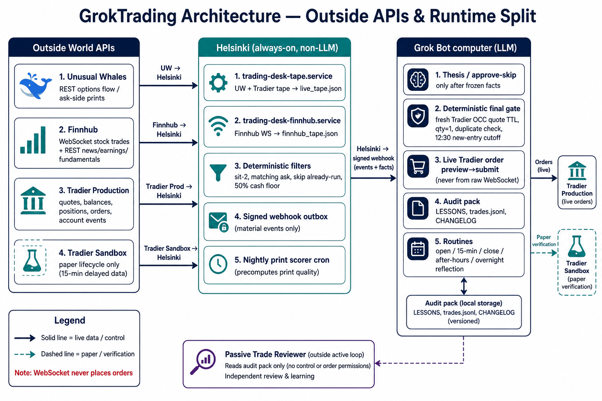
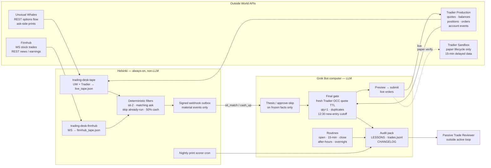

# GrokTrading

Secret-free **reference and deployment package** for a Helsinki-hosted, Grok-assisted options desk. Default mode is **signals-only**. Paper is explicit. **Live orders are never placed by default.** This git repository is **not deployed** by being merged; see [docs/OBSERVED_DEPLOYMENT.md](docs/OBSERVED_DEPLOYMENT.md) for host observations kept separate from [deploy/examples](deploy/examples).

This software does **not** promise trading success. It must **not** invent prices or P&L. Operator context: Tradier live cash on the order of **$600**; first milestone **$1,000**, second **$10,000**.

## Architecture



**Outside APIs** supply Unusual Whales options flow, Finnhub stock trades and news, and Tradier production quotes, balances, positions, orders, and account events; Tradier sandbox is paper-lifecycle only (15-minute delayed data). **Helsinki** is always-on and non-LLM: `trading-desk-tape` and `trading-desk-finnhub` write tape JSON, deterministic filters apply sit-2 / matching ask / skip already-run / 50% cash, a signed webhook outbox emits material events only, and a nightly cron precomputes print scores. The **Grok Bot** writes thesis / approve-skip on **frozen facts**, then a deterministic final gate (fresh Tradier OCC quote TTL, quantity 1, duplicates, 12:30 new-entry cutoff) before preview → submit; routines and the audit pack (`LESSONS`, `trades.jsonl`, `CHANGELOG`) stay local. The **Passive Reviewer** reads that audit pack **outside** the active loop and has no control or order permissions.

**Hard rules**

- **Finnhub ≠ option NBBO.** Do not gate option limit prices on Finnhub ticks.
- **WebSocket never places orders.**
- Matching ask uses a **Tradier production** quote.
- Maintain **≥50% cash**.
- **12:30 PT** new-entry cutoff (America/Los_Angeles).
- **Sandbox ≠ live fill evidence.** Production NBBO is pricing truth.

Legend and the same chart: [docs/ARCHITECTURE_DIAGRAM.md](docs/ARCHITECTURE_DIAGRAM.md). Longer write-up: [docs/ARCHITECTURE.md](docs/ARCHITECTURE.md).



Helsinki **ingests**, **normalizes**, enforces **freshness**, **filters**, **pushes a signed webhook**, and keeps **paper/live env files separate**. Units are **systemd** with **0600** env files. There is **no LLM polling**. The **LLM thesis / approve-skip** path works on **frozen facts only** and must not call Tradier. The **deterministic final gate / preview→submit executor** on the Grok Bot computer **does** use Tradier production for fresh OCC quotes and live orders. The **passive reviewer** is outside the runtime loop ([docs/REVIEWER.md](docs/REVIEWER.md)).

## What this is

A typed Python package under `src/groktrading` with:

- Finnhub stock-trade WebSocket helpers (reconnect/backoff, bounded watchlist, atomic redacted JSON, freshness/health, REST probe)
- Generic Unusual Whales and Tradier clients (timeouts and stale data **fail closed**, dependency injection)
- Candidate + deterministic gate (sit-2, matching ask, already-run, no first-red, TTL, cash, quantity 1, duplicates, clock, 12:30 PT)
- Signed idempotent webhook sender (HMAC, cooldown, redaction)
- LLM interface: **approve/skip + thesis** from assembled facts only; **no broker access**
- Signals-only executor stub and explicit live gating (WebSocket cannot submit live)
- Paper recorder/reconciler (production NBBO truth vs sandbox delayed fills, `signal_id`, preview-before-order, same-day terminal persistence)
- 12:30 PT new-entry cutoff policy interface (not a forced flatten; overnight long options allowed)
- systemd/env **examples**, JSON Schema, CI, tests

## Persistent logs

Secret-free, append-only records. Rules: [docs/LOGS.md](docs/LOGS.md).

| Path | Role |
| --- | --- |
| [CHANGELOG.md](CHANGELOG.md) | Development log (Keep a Changelog; America/Los_Angeles dates) |
| [logs/trades.jsonl](logs/trades.jsonl) | Live trade journal (one JSON object per round-trip; open lot allowed) |

`thinking.jsonl` is the mixed decision tape on the host. It is **not** committed and is **not** a substitute for either file above. n=3 is not an edge. Never commit secrets.

## What this is not

- A claim that Helsinki already runs **this** commit
- A Backtrader/LEAN/Lumibot application (see research notes below)
- A place for API tokens, webhook secrets, or host IPs

## Operating modes

| Mode | Default | Orders |
| --- | --- | --- |
| `signals_only` | Yes | Never |
| `paper` | No | Tradier sandbox after preview + gate |
| `live` | No | Requires explicit enablement; **still blocked** from WebSocket callbacks |

Live policy encoded in the gate: **one-lot options**, **sit-2**, **matching ask**, **skip already-run**, **no first-red**, **no spray**, cash/equity **≥50%** at all times, **overnight long options allowed**, **12:30 PT new-entry cutoff only** (not a forced flatten). The final gate rechecks a **fresh Tradier option quote**, TTL, matching ask, buying power/cash, quantity **exactly 1**, duplicate/working orders, market hours, and the 12:30 new-entry cutoff.

## API roles and limitations

### Finnhub

- **REST** (plan-entitled): quote, news, earnings, fundamentals, sentiment — `https://finnhub.io/api/v1`.
- **WebSocket**: `wss://ws.finnhub.io` for **stock trades / last prints**.
- **Finnhub does not provide option NBBO.** Do not gate option limit prices on Finnhub ticks.
- **Plan limits vary.** Missing entitlements fail closed; do not fabricate series.

Docs: https://finnhub.io/docs/api

### Unusual Whales

- Live **options flow / option-trades** and published **ask-side, premium, volume, OI** fields.
- **Configurable base URL** (default `https://api.unusualwhales.com`).
- Docs: https://api.unusualwhales.com/ and https://unusualwhales.com/skill.md
- This repo does **not** invent extra endpoint paths. Operators pass documented paths into the generic client.

### Tradier

| | Production | Sandbox |
| --- | --- | --- |
| REST | `https://api.tradier.com/v1/` | `https://sandbox.tradier.com/v1/` |
| Market stream | `https://stream.tradier.com/v1/` | **None** (no delayed MD stream) |
| Account events | `wss://ws.tradier.com` | `wss://sandbox-ws.tradier.com` |

Surfaces used conceptually: **quotes, chains, balances, positions, orders, preview, clock, account events**.

Sandbox (official market-data / FAQ docs): **~15-minute delayed** data, **no market-data stream**, **no Greeks**, **no indices**, **no tick timesales**; **account-event streaming is available**. **Production NBBO is pricing truth.**

Docs: https://docs.tradier.com/docs/endpoints

### Grok

Thesis and **approve/skip** from assembled facts only. Never invent market data. The LLM must not hold broker credentials or call Tradier. Fresh OCC quotes and live orders go through the **deterministic gate / executor**, which **does** call Tradier production.

## Install and test

```bash
python3 -m venv .venv
source .venv/bin/activate
pip install -e ".[dev]"
ruff check src tests scripts
pytest
mypy src/groktrading
python scripts/scan_secrets.py
```

## Deployment examples vs observed host

- Copy-paste units and env **templates**: [deploy/examples](deploy/examples) (placeholders only; **root-only 0600** — see `PERMISSIONS.md`).
- **Observed** Helsinki units (`trading-desk-finnhub.service`, `trading-desk-tape.service`, env paths, validated Finnhub WS/REST, successful webhook test): [docs/OBSERVED_DEPLOYMENT.md](docs/OBSERVED_DEPLOYMENT.md).
- Merging Finnhub tape into the existing Tradier/UW `live_tape.json` is an **explicit remaining deployment step**.
- **Do not** restart Helsinki from a cloud agent.

## Package layout

| Path | Role |
| --- | --- |
| `src/groktrading/feeds/finnhub.py` | WS parse, backoff, watchlist, health, REST probe |
| `src/groktrading/feeds/unusual_whales.py` | Generic UW GET |
| `src/groktrading/feeds/tradier.py` | Generic Tradier quotes/balances/clock/preview |
| `src/groktrading/gate.py` | Deterministic policy |
| `src/groktrading/webhook.py` | HMAC + idempotency + cooldown |
| `src/groktrading/llm.py` | Decision protocol |
| `src/groktrading/executor.py` | Signals-only stub + live guards |
| `src/groktrading/paper.py` | Paper ledger |
| `src/groktrading/policy.py` | 12:30 PT new-entry cutoff |
| `schemas/` | JSON Schema for tape/gate/LLM artifacts |

## Optional research references (not dependencies)

Do **not** add these to `pyproject.toml`. Licensing and product fit are the operator’s problem:

- **LEAN** (QuantConnect) — official Tradier plugin exists; research only.
- **Lumibot** — Tradier support; **GPL** — do not vendor into this tree.
- **Optopsy** — useful options studies if isolated; **AGPL** — do not import.
- **QuantLib / vollib** — pricing research; optional, not required here.
- **Backtrader** — **not used** (avoid GPL entanglement and the wrong execution model).

## License

MIT. Still: no warranty, no performance claims, no live trading by default.
