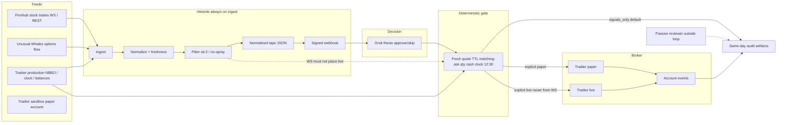

# Architecture

Visual: [ARCHITECTURE_DIAGRAM.md](ARCHITECTURE_DIAGRAM.md) and [groktrading-architecture.png](groktrading-architecture.png). WebSockets, Helsinki tape vs package `feeds/`, webhook events, and the print→submit sequence: [WEBSOCKETS.md](WEBSOCKETS.md). Auditor brief: [OPENAI_AUDIT_BRIEF.md](OPENAI_AUDIT_BRIEF.md).

This repository is a **public reference and deployment package** intended for external audit. It is not itself a live trading deployment. Default mode is `signals_only`. Paper is explicit. Live order placement is never the default and cannot be driven by WebSocket callbacks. Live trading is operator-gated.

**Capital frame:** planning / selection / multi-lift sizing is **$25,000** (YOLO expansion, not preservation). Live Tradier fills may still be cash-constrained on a smaller funded balance until that deposit lands. Do not treat planning capital as current broker equity. Encoded gate math remains one-lot (`qty == 1`).

## Runtime loop vs reviewer

The **passive reviewer** sits outside the active loop. Review happens on git diffs, PRs, and after-the-fact audit files. Reviewer comments must not be required for a tick, a webhook, or a gate decision.

## Data flow

## Helsinki responsibilities

| Stage | Behavior |
| --- | --- |
| Ingest | Finnhub last prints, UW flow (documented paths), Tradier quotes/chains/clock/balances/positions/orders/events |
| Normalize | Typed models, UTC timestamps, redaction before disk |
| Freshness | TTL fail-closed; stale UW/Tradier/Finnhub data cannot pass the gate |
| Filter | Sit-2, skip already-run, no first-red, no spray, one-lot only |
| Webhook | Signed HMAC, idempotency key, cooldown; **no LLM polling** |
| Paper vs live | Separate env files and account IDs; production NBBO is pricing truth |
| systemd | Units load root-only `0600` env files; examples live under `deploy/examples/` |

Finnhub tape integration into an existing Tradier/UW tape is an **explicit operator deployment step**. This repo does not perform that merge and does not claim to be deployed. See `docs/OBSERVED_DEPLOYMENT.md`. Rebuild-anywhere steps (new VPS / parallel `/opt/groktrading` / cutover): [DEPLOY.md](DEPLOY.md).

## Grok role

The **LLM thesis / approve-skip** path consumes **assembled facts only**. It returns `approve` or `skip` plus a thesis. It must not invent prices, P&L, or fills, and it must not call Tradier or hold a broker client. After an `approve`, the **deterministic final gate / preview→submit executor** on the Grok Bot computer **does** use Tradier production for a **fresh OCC quote** and, when explicitly enabled, live orders.

## Dual-broker

Live/paper execution goes through a venue-aware `Broker` protocol
([DUAL_BROKER.md](DUAL_BROKER.md)). Today the only implementer is
`TradierBroker` (thin wrap of `feeds/tradier.py`). Schwab OAuth scaffolding
is in `brokers/schwab_oauth.py`; `SchwabBroker` still fails closed and cannot
place orders until Phase B/C. No secrets in git. A print is
never dual-fired; exits follow the holding venue. **Opening15 Tuesday
packet-only `research.cli run` does not use this protocol.**

## Safety invariants

- WebSocket events never directly trigger live orders.
- Quantity on options is exactly **1** contract.
- Cash/equity **≥20%** at all times (max deploy 80%). **Overnight long options are allowed.** **12:30 America/Los_Angeles** is a **new-entry cutoff only**, not a forced flatten. OpenAI flatten-everything / no-overnight is rejected. Grok/LLM is **outside** the broker execution boundary.
- Matching ask; skip already-run; no first-red; sit-2. No hard concurrent-position caps. No daily-loser circuit breaker.
- Timeouts and stale quotes fail closed. Webhook events: `sit_match`, `in_position`, `cash_up` (`entry_cutoff_only_no_flatten`), `day_win_target` (`auto_flatten: false`). Details: [WEBSOCKETS.md](WEBSOCKETS.md).
