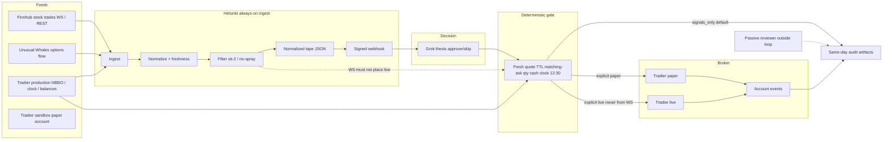

# Architecture

This repository is a **reference and deployment package**. It is not itself a live trading deployment. Default mode is `signals_only`. Paper is explicit. Live order placement is never the default and cannot be driven by WebSocket callbacks.

## Runtime loop vs reviewer

The **passive reviewer** sits outside the active loop. Review happens on git diffs, PRs, and after-the-fact audit files. Reviewer comments must not be required for a tick, a webhook, or a gate decision.

## Data flow

## Helsinki responsibilities

| Stage | Behavior |
| --- | --- |
| Ingest | Finnhub last prints, UW flow (documented paths), Tradier quotes/chains/clock/balances/positions/orders/events |
| Normalize | Typed models, UTC timestamps, redaction before disk |
| Freshness | TTL fail-closed; stale UW/Tradier/Finnhub data cannot pass the gate |
| Filter | Sit-2, skip already-run, no first-red, no spray, one-lot only |
| Webhook | Signed HMAC, idempotency key, cooldown; **no LLM polling** |
| Paper vs live | Separate env files and account IDs; production NBBO is pricing truth |
| systemd | Units load root-only `0600` env files; examples live under `deploy/examples/` |

Finnhub tape integration into an existing Tradier/UW tape is an **explicit operator deployment step**. This repo does not perform that merge and does not claim to be deployed. See `docs/OBSERVED_DEPLOYMENT.md`.

## Grok role

Grok consumes **assembled facts only**. It returns `approve` or `skip` plus a thesis. It must not invent prices, P&L, or fills, and it must not hold a broker client. After an `approve`, the **deterministic gate** rechecks a **fresh Tradier option quote**.

## Safety invariants

- WebSocket events never directly trigger live orders.
- Quantity on options is exactly **1** contract.
- Flatten / cancel by **12:30 America/Los_Angeles**. No overnight positions.
- Matching ask; skip already-run; no first-red; sit-2.
- Timeouts and stale quotes fail closed.
