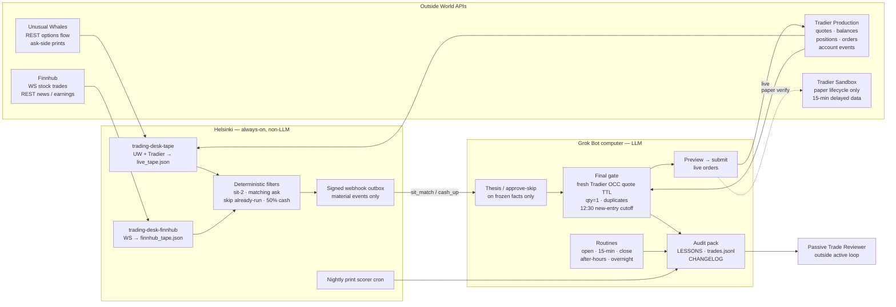

# Architecture diagram

Runtime split for GrokTrading: outside APIs, Helsinki (always-on, non-LLM), the Grok Bot computer (LLM), and a passive reviewer outside the active loop.

Longer prose: [ARCHITECTURE.md](ARCHITECTURE.md). API surfaces: [API_MATRIX.md](API_MATRIX.md). Reviewer: [REVIEWER.md](REVIEWER.md).

## Legend

| Mark | Meaning |
| --- | --- |
| Solid arrow | Live data or control |
| Dashed arrow | Paper / verification only |
| Outside World APIs | Unusual Whales flow, Finnhub stock WS/REST, Tradier production, Tradier sandbox |
| Helsinki | Always-on ingest, filters, signed webhook, nightly scorer — **no LLM** |
| Grok Bot computer | Thesis / approve-skip on **frozen facts**, then a deterministic final gate |
| Passive Trade Reviewer | Reads the audit pack after the fact; **no** control or order permissions |

**Hard rules:** Finnhub is not option NBBO. WebSocket never places orders. Matching ask uses a Tradier **production** quote. Maintain **≥50% cash**. **12:30 PT** new-entry cutoff. Sandbox is **not** live fill evidence.

## Mermaid (GitHub-native)

