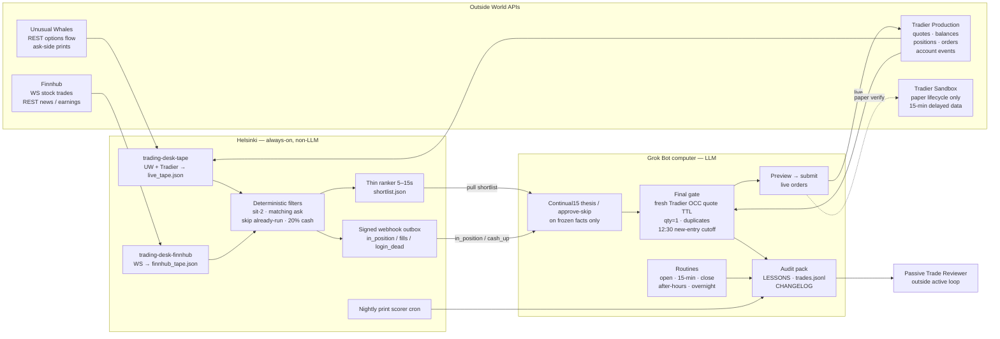

# Architecture diagram

Runtime split for GrokTrading: outside APIs, Helsinki (always-on, non-LLM), the Grok Bot computer (LLM), and a passive reviewer outside the active loop.

Longer prose: [ARCHITECTURE.md](ARCHITECTURE.md). Hunt planes: [REALTIME_PLANES.md](REALTIME_PLANES.md). WebSockets: [WEBSOCKETS.md](WEBSOCKETS.md). Auditor brief: [OPENAI_AUDIT_BRIEF.md](OPENAI_AUDIT_BRIEF.md). API surfaces: [API_MATRIX.md](API_MATRIX.md). Reviewer: [REVIEWER.md](REVIEWER.md).

## Legend

| Mark | Meaning |
| --- | --- |
| Solid arrow | Live data or control |
| Dashed arrow | Paper / verification only |
| Outside World APIs | Unusual Whales flow, Finnhub stock WS/REST, Tradier production, Tradier sandbox |
| Helsinki | Always-on ingest, filters, signed webhook, nightly scorer — **no LLM** |
| Grok Bot computer | **LLM** thesis / approve-skip on **frozen facts only** (must not call Tradier). **Gate / executor** uses Tradier production for fresh OCC quotes and live orders |
| Passive Trade Reviewer | Reads the audit pack after the fact; **no** control or order permissions |

**Hard rules:** Finnhub is not option NBBO. WebSocket never places orders; the final gate rechecks a fresh Tradier **production** quote. Matching ask uses production NBBO. Maintain **≥20% cash/equity** (max deploy 80%). Overnight longs allowed. **12:30 PT** new-entry cutoff only (not a flatten). Grok is outside the broker boundary. Sandbox is **not** live fill evidence. Planning capital is **$25k** (YOLO expansion); do not confuse that with current broker equity.

## Mermaid (GitHub-native)

