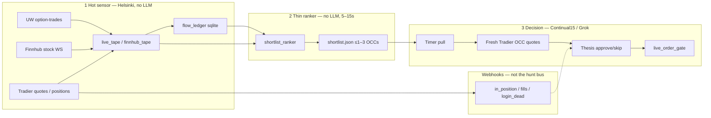

# Three-plane realtime desk

Authoritative hunt architecture. Replaces webhook→LLM `sit_match` firehose.

**Operator overlay 2026-09-17 PT (current):** live hunt is Continual15 on
`CRON_TZ=America/New_York */5 9-15 * * 1-5` (**5-minute floor**, not a
literal 15-minute-only loop). Opportunity / `sit_match` /
`shortlist_opportunity` stay **KEEP_PAUSED**. I1 consume is **SOFT 180s**
(hard stale only >180). Ask band **HARD ±$0.02**. Take-gain TRIAL arm
×**1.25** / protect 50% of peak (not ×1.40). UW MCP **DEFERRED**. Friday+
shadow tags are **SCORE-ONLY**. Package `SIT_MATCH_MAX_AGE_SEC` default
is still 60s until copied. Full card: [README.md](../README.md). Host
facts: [OBSERVED_DEPLOYMENT.md](OBSERVED_DEPLOYMENT.md).

**Merge ≠ Helsinki restart.** This file is package truth. It is **not** a
claim the host already runs this commit, that the ranker timer is enabled,
or that `/opt/trading-desk/state/shortlist.json` exists on Helsinki.

Related: [WEBSOCKETS.md](WEBSOCKETS.md), [README.md](../README.md),
[astra_realtime_planes_audit_20260912.md](astra_realtime_planes_audit_20260912.md),
[OBSERVED_DEPLOYMENT.md](OBSERVED_DEPLOYMENT.md).

## Why this exists

Friday 2026-09-11 the desk still made a journaled-elsewhere WIN
(`QQQ260911P00717000` BTO 1.06 → STC 1.45; book $421.74 → $460.56;
`close_pl` +$39; take-gain **TRIAL n=1**). Process on the webhook path was
not the reason: ~20+/min `sit_match` POSTs queued Cursor wakes (p50 ~16m)
while HTTP was always ~0.5–0.7s. PR #34 made `print_age_sec` honest and
throttled the producer. Host then set `SIT_MATCH_MIN_INTERVAL_SEC=300`.

**300s is a Cursor wake bandage. It is not the trading latency target and
it is not the realtime design.** Producer 300s ∩ consume
`SIT_MATCH_MAX_AGE_SEC=60` is near-empty. Do **not** raise I1 / inbox
`MAX_AGE` to 300 so those POSTs “pass.”

Default hunt is **not** sit_match. Default hunt is three planes.

## The three planes

| Plane | Who | Cadence | LLM? | Orders? |
| --- | --- | --- | --- | --- |
| **1 Hot sensor** | Helsinki `trading-desk-tape` + `trading-desk-finnhub` | Continuous WS/REST | No | No |
| **2 Thin ranker** | `groktrading.shortlist` / `scripts/shortlist_ranker.py` | **5–15s** (default **10s**) | No | No |
| **3 Decision** | Continual15 on the Grok Bot | `*/5` RTH ET (5-minute floor; not 15-minute-only) after 09:30–09:45 ET stand-down, through **15:00 ET** | Yes (frozen facts only) | Only via `live_order_gate` after fresh Tradier quotes |

Rate-limit **candidates** (≤1–3 OCCs in `shortlist.json`), **not** the tape.
The hot sensor must keep writing. The ranker is a filter, not a mute on UW.

## Numbers (do not mix these clocks)

| Knob | Meaning | Default | Must not |
| --- | --- | --- | --- |
| `SIT_MATCH_MAX_AGE_SEC` | **Print freshness (I1).** Package / inbox helper default | **60s** (package). Operator live consume **SOFT 180s** (hard stale only >180) | Raise the helper to match any producer interval (including 300s) and call that the live clock |
| `SHORTLIST_MAX_AGE_SEC` | Ranker print-age cap | Unset → I1 60s | Set above I1. Optional **tighten 15–30s** for lifts. Ranker clamps any widen down to I1 |
| `SHORTLIST_CADENCE_SEC` | Ranker timer | **10** (clamp 5–15) | Treat 300s as this cadence |
| `SHORTLIST_STALE_SEC` | **Document** freshness for Continual15 (`ranked_at`) | **30s** (or `2 × cadence`) | Raise to 300s so a dead ranker still hunts |
| `SIT_MATCH_MIN_INTERVAL_SEC` | Cursor wake bandage on optional `sit_match` POSTs | Package **60**; host Mon prep **300** | Use as hunt latency or as an excuse to widen `MAX_AGE` |
| `SIT_MATCH_WEBHOOK` | Optional rare `sit_match` alert | **Hunt default off** | Turn it into the selection loop |

`created_at` / `timestamp` / inbound `print_age_sec` are **not** execution
clocks. `print_age_sec` is overwritten from `executed_at` if a `sit_match`
POST is ever used in rare-alert mode (PR #34).

## Plane 1 — hot sensor (Helsinki, no LLM)

Continuous Unusual Whales + Finnhub + Tradier → ledger / tape.

- Units (observed host names): `trading-desk-tape.service` (`ws_tape.py`),
  `trading-desk-finnhub.service`. **Host-owned.** Not this git tree.
- Writes: `live_tape.json`, `finnhub_tape.json`, append-only
  `uw_flow.sqlite` when the flow-ledger companion is wired. Companion
  `GET /api/option-trades` must pass **`issue_types[]=Common Stock` and
  `issue_types[]=ETF`** (urlencode list of tuples). Common Stock alone
  excludes SPY/QQQ desk coverage. Does **not** re-enable `sit_match`
  webhooks.
- **No per-print Grok wake.** No LLM on Helsinki. No preview→submit.
- Companions keep `emit_sit_match=False`. Flow-alerts stay local JSONL.
- `live_tape.json` shape is **host-owned and not specified in this repo**.
  The ranker accepts a JSON list of UW-like rows, a few obvious list keys
  (`prints`, `option_trades`, `rows`, …), or `flow_ledger` rows. When both
  `FLOW_LEDGER_PATH` and `LIVE_TAPE_PATH` are set, **both** are inputs.
  The ledger window is the 200 newest rows that stored `executed_at`
  (ISO or websocket epoch ms on that field). Clock-less flow-alert rows
  (`created_at` only) do not fill it. Unknown shapes yield an empty
  shortlist — they are not invented. `created_at` is still not the clock.

Finnhub ≠ option NBBO. WebSocket never places orders.

## Plane 2 — thin ranker (no LLM)

Every **5–15s** emit schema-stable `shortlist.json` with **≤1–3 OCCs** that
already pass:

| Filter | Rule | Clock / source |
| --- | --- | --- |
| Print freshness | `executed_at` age ≤ I1 60s (optional tighten 15–30s) | Same I1 helper as `sit_match` |
| Premium band | Per-share **ask/print** ∈ **$0.50–$2.00** | Shortlist hunt band (`PREMIUM_BAND_LO`/`HI`). Independent of `policy.MUST_TRADE_SMALL_ASK_CAP` ($1.50). **Not** UW dollar `premium` (notional, often ≥10k) |
| Hard skips | `META` / `NET` / `MU` / `AMD` | Underlying |
| No SPCX reopen | Skip all `SPCX` | Underlying |
| No INTC puts | Skip `INTC` puts only (calls may pass other filters) | Underlying + right |
| Already-run | Skip when detectable (`already_run` flag, session underlyings/OCCs) | Do not invent a skip when undetectable |
| In position | Skip when detectable (OCC / underlying lists) | Decision plane still re-reads Tradier |

Package SoT: `groktrading.shortlist`. CLI: `scripts/shortlist_ranker.py`
(`groktrading-shortlist`). Schema: `schemas/shortlist.json`
(`groktrading.shortlist.v1`). Tests cover schema stability and freshness
refuse without secrets.

**Host path (ops documentation):** `/opt/trading-desk/state/shortlist.json`.

Example systemd ( **not auto-enabled** ):
`deploy/examples/systemd/shortlist-ranker/`.
`install_helsinki.sh` does not copy, enable, or start it.
`emit_sit_match` is false. Example unit sets `SIT_MATCH_WEBHOOK=0`.

Offline skeleton: if no `--prints` / `--tape` / `--ledger` exists, the CLI
writes a valid empty document (`empty_reason=no_input`) and exits 0. Invalid
`SHORTLIST_MAX_AGE_SEC` (inf/NaN) fail-closes (exit 2) and does not
overwrite a previous file with a lying-fresh list.

## Plane 3 — decision (Continual15 / Grok)

Timer loop on the Bot:

1. Pull `shortlist.json`.
2. `evaluate_shortlist_document` — refuse stale `ranked_at`, empty
   candidates, bad schema, or a list cleared by `in_position`.
3. Fresh **Tradier production** quotes for the remaining OCCs.
4. Thesis / approve-skip on **frozen facts**.
5. `tools/live_order_gate` (BTO entry / named STC exits). This package
   never POSTs.

Continual15 window: `CRON_TZ=America/New_York */5 9-15 * * 1-5` after
**09:30–09:45 ET** open stand-down, through **15:00 ET** (before 12:30 PT
/ 15:30 ET new-entry cutoff). Close card **16:00 ET**. Encoded cutoff
stays **12:30 America/Los_Angeles**. The “15” in Continual15 is the
strategy name, **not** a claim of one look per 15 minutes.

Opening15 is research-only. It is not this loop.

## Webhooks (reserved — not the hunt bus)

| Event | Role after this design |
| --- | --- |
| `in_position` | Position-truth / do-not-spray. **Keep.** |
| fills / working-order / `login_dead` | Session integrity. **Keep.** |
| `cash_up` | 12:30 PT entry-cutoff notice (`entry_cutoff_only_no_flatten`) |
| `day_win_target` | Informational (`auto_flatten: false`) |
| `sit_match` | **Deprecated as hunt bus.** **KEEP_PAUSED.** Do
  not unmute for hunt. Optional rare alert remains unused. |
| `shortlist_opportunity` | **KEEP_PAUSED.** Host script
  `/opt/trading-desk/bin/shortlist_opportunity_webhook.py` is
  operator-side (in-repo contract:
  `deploy/examples/helsinki/shortlist_opportunity_webhook.py`). Not the
  hunt bus. |

`SIT_MATCH_MIN_INTERVAL_SEC=300` on the host is how Friday’s firehose was
stopped. Leave it as a bandage on the optional alert path. **Default hunt
must not depend on it.** **`sit_match` stays OFF.**

### Opportunity wake-latency posture (KEEP_PAUSED as of 2026-09-17)

Monday `I1_stale` backlog was wake latency. **Current:** opportunity /
`sit_match` / `shortlist_opportunity` stay **KEEP_PAUSED**. The <30s
refuse-or-lift path below is **historical re-enable criteria**, not an
active unlock. Emit knobs if a later named review ever re-enables:
TOP1_ONLY, wall-clock `executed_at`, `SHORTLIST_OPP_MAX_AGE_SEC=45`, OCC
debounce 600s, global min interval 300s.

| Knob | Value | Must not |
| --- | --- | --- |
| `sit_match` | **OFF** | Re-enable as hunt bus |
| `shortlist_opportunity` emit | **TOP1_ONLY** | Spray the full shortlist |
| Print freshness | wall-clock `executed_at` | Use inbound `print_age_sec` / `created_at` |
| `SHORTLIST_OPP_MAX_AGE_SEC` | **45** | Raise toward 300s or past I1 60s |
| OCC debounce | **600s** | Per OCC\|`executed_at` firehose |
| Global min interval | **300s** | Treat as hunt cadence |
| Live I1 consume | Operator **SOFT 180s** (hard stale only >180). Package helper default **60s** | Treat package 60s as the live clock, or unlock further so stale wakes “pass” |
| Opportunity timer | **KEEP_PAUSED** | Re-enable on hope / backlog pressure |
| Hunt while timer paused | **Continual15 + `shortlist.json`** | Wait on opportunity / sit_match POSTs |
| `MUST_TRADE_SMALL_ASK_CAP` | **$1.50** (unchanged) | Widen the live must-trade cap |

Host path is ops documentation, **not** a deploy claim. This repo does
not copy or start `/opt/trading-desk/bin/shortlist_opportunity_webhook.py`.

Observational RSI of the I1_stale backlog:
[`tools/shadow_bets`](../tools/shadow_bets) (`yes_latency_fix_wake` is a
label only).

## Monday ops

Until `shortlist.json` is actually refreshing on the host:

1. **`sit_match` stays OFF.** Weekend mute stays. Open-card unmute is
   **not** required and is not hunt.
2. **Hunt bus default = Continual15 + `shortlist.json`** while the
   opportunity timer is paused. Do not sit waiting for a 300s∩60s webhook.
3. After an operator copies the ranker timer and confirms
   `/opt/trading-desk/state/shortlist.json` `ranked_at` is ≤30s old in RTH,
   Continual15 may pull the shortlist. That copy is **not** this merge.
4. **`shortlist_opportunity` stays KEEP_PAUSED** (2026-09-17). The <30s
   refuse-or-lift path is historical criteria, not a current unlock.
5. Finnhub was restarted (ops fact). Restarting Finnhub again is still an
   operator action. This PR does not restart it.
6. Take-gain remains **TRIAL** (arm ×**1.25** / protect 50% of peak —
   Darryl 2026-09-17). Do not lock. Do not treat ×1.40 as current.
   Operator live I1 is **SOFT 180s**.

**Merge ≠ Helsinki restart.** Merging this repo does not enable the timer,
does not unmute sit_match, and does not deploy `/opt/trading-desk`.

## Fail-closed (decision plane)

| Condition | Consume | Hunt |
| --- | --- | --- |
| Missing / unparseable `ranked_at` or wrong `schema` | `shortlist_schema` | Idle. No Grok wake from this file |
| `ranked_at` older than `SHORTLIST_STALE_SEC` | `shortlist_stale` | Idle. Do not trade a dead ranker |
| `candidates == []` | `shortlist_empty` | Idle. Empty is valid ranker output |
| All remaining OCCs are `in_position` | `shortlist_in_position_cleared` | Idle. Re-read Tradier before any BTO anyway |
| Print `executed_at` > I1 60s | Never enters the file | I1 / gate still refuse if a stale row is smuggled |

Account-events is still files-only / disabled. Position truth after STC is
Bot + Tradier REST until an operator enables that unit.

## Clocks (do not collapse)

| Clock | Zone | Role |
| --- | --- | --- |
| Host trading routines | `CRON_TZ=America/New_York` | Open card 09:00 ET (not hunt). Continual15 after stand-down through 15:00 ET. Close **16:00 ET** |
| Open stand-down | ET | **Only 09:30–09:45 ET**, then hunt |
| Encoded new-entry cutoff | 12:30 `America/Los_Angeles` | New BTO only. 15:30 ET |
| Print freshness | UTC `executed_at` | I1 60s |
| Shortlist document | UTC `ranked_at` | Default 30s stale |
| Repo example crons | often `America/Los_Angeles` | **Docs ≠ host** |

Friday’s close card wrongly fired at 13:00 America/Toronto (mid-RTH). Any
new cron must state `CRON_TZ` and city.

## What this package ships vs what the host must do

| In this repo | Host (operator) |
| --- | --- |
| `groktrading.shortlist` + tests | Copy timer/service if wanted |
| `scripts/shortlist_ranker.py` | Point at real ledger/tape paths |
| Example units under `deploy/examples/systemd/shortlist-ranker/` | `systemctl enable --now` **only if you intend to** |
| Docs + Astra audit | Confirm `shortlist.json` mtime/ranked_at in RTH |
| sit_match helper unchanged for rare alerts | Keep `ws_tape.py` host-owned; prefer webhook off for hunt |

**No claim this commit is live on Helsinki.**

## Desk board (observational — not a plane)

[`dashboard/`](../dashboard/) renders the opportunity-process funnel
from refuse evidence and may attach READ-ONLY tape health. It is **not**
plane 1/2/3. It does **not** unmute `sit_match`, does **not** resume
the `shortlist_opportunity` timer, and does **not** write
`shortlist.json`. Hunt default while that timer is paused remains
**Continual15 + `shortlist.json`**. [DASHBOARD.md](DASHBOARD.md).
Helsinki weekday RTH refresh of the Vercel board is a separate zero-LLM
companion ([LIVE_BOARD_REFRESH.md](LIVE_BOARD_REFRESH.md)); Continual15
still writes pack evidence cards separately.
