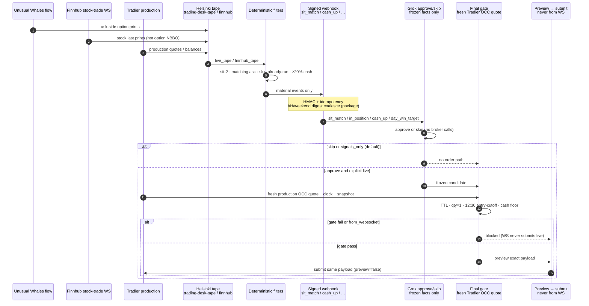

# WebSockets, webhooks, and why ticks never place orders

This page is for an **external auditor** who has never seen the Helsinki host. It describes what each stream **carries**, what it **does not carry**, and why a WebSocket event **cannot** become a live Tradier order.

Related: [ARCHITECTURE.md](ARCHITECTURE.md), [ARCHITECTURE_DIAGRAM.md](ARCHITECTURE_DIAGRAM.md), [SAFETY.md](SAFETY.md), [API_MATRIX.md](API_MATRIX.md), [OPENAI_AUDIT_BRIEF.md](OPENAI_AUDIT_BRIEF.md). Live card: [README.md](../README.md).

**Hard rule:** WebSocket events never place live orders. The final gate rechecks a **fresh Tradier production** option quote before any preview→submit path. Default package mode remains `signals_only`.

## Two runtimes (do not collapse them)

| Path | What it is | Order path |
| --- | --- | --- |
| **Helsinki live ingest** | Hand-built `/opt/trading-desk` (no `.git`). Units: `trading-desk-tape.service` (`ws_tape.py`) and `trading-desk-finnhub.service`. | **None.** Helsinki **webhooks** candidates. No preview→submit on the host. |
| **This package `feeds/`** | Typed helpers under `src/groktrading/feeds/` (Finnhub parse/backoff/health, generic UW GET, generic Tradier REST). Example units are `groktrading-*.service`. | Stub-safe `OrderMachine` on the **Grok consumer** side only, and only after an explicit live enablement. **Never** from a WS callback. |

Merging this repo does **not** mean Helsinki runs this commit. Observed host facts: [OBSERVED_DEPLOYMENT.md](OBSERVED_DEPLOYMENT.md).

## What each stream carries (and does not)

### Finnhub stock-trade WebSocket

- **URL:** `wss://ws.finnhub.io` (token as query param; never log the URL unredacted).
- **Carries:** stock **last prints / trades** (`type=trade`: symbol, price, volume, exchange timestamp, conditions). Package schema: `schemas/finnhub_trade.json`.
- **REST (plan-entitled, not the WS):** quote, news, earnings, fundamentals, sentiment at `https://finnhub.io/api/v1`.
- **Does NOT carry:** option NBBO, option bid/ask, OCC quotes, Greeks, or anything that can set an option limit.
- **Must not:** gate option limit prices on Finnhub ticks. `Finnhub ≠ option NBBO`.

Helsinki observation (not this commit): `trading-desk-finnhub` writes `finnhub_tape.json` (SPY/QQQ ticks were live-validated). Package helper: `src/groktrading/feeds/finnhub.py` (`ReconnectingFinnhubClient`, `FinnhubStreamState`).

### Helsinki `trading-desk-tape` (UW + Tradier)

- Unusual Whales **REST options flow** (ask-side prints, premium, volume, OI as published).
- Tradier **production** quotes / balances / positions / orders / clock used by the tape writer.
- Writes `live_tape.json`.
- **This is not** the package `groktrading-tape` skeleton (`package_tape_skeleton.json`). `ws_tape.py` is **not** in this git tree. `sit_match` freshness lives in `groktrading.sit_match` (package emitter + inbox). After merge, an operator must apply the same gate in the live Helsinki `ws_tape` sit_match branch and restart `trading-desk-tape`. `install_helsinki.sh` does not copy or replace `ws_tape.py`.

### Package `feeds/` (reference, injectable, fail-closed)

| Module | Role |
| --- | --- |
| `feeds/finnhub.py` | WS parse, reconnect/backoff, bounded watchlist, freshness/health, REST probe. Tape note: *stock last prints only; not option NBBO; never triggers live orders.* |
| `feeds/unusual_whales.py` | Generic UW GET. Caller supplies a documented path. Timeouts fail closed. |
| `feeds/tradier.py` | Generic Tradier quotes / balances / clock / preview. Timeouts and stale data fail closed. |

Merging the Finnhub tape into the existing Tradier/UW `live_tape.json` is an **explicit remaining operator step**. This repo does not perform it.

### Tradier streams (not an order path)

| Environment | REST | Market stream | Account-event WS |
| --- | --- | --- | --- |
| Production | `https://api.tradier.com/v1/` | `https://stream.tradier.com/v1/` | `wss://ws.tradier.com` |
| Sandbox | `https://sandbox.tradier.com/v1/` | **None** | `wss://sandbox-ws.tradier.com` |

Account-event WebSockets report broker session events. They are **not** a submit path. Sandbox market data is ~15-minute delayed. **Production NBBO is pricing truth.**

## Why WebSocket events never place live orders

Three independent locks (code, not prose):

1. **Executor WS path** (`executor.Executor.on_websocket_event`): marks `from_websocket=True`, records a gate result, then **raises `LiveGatingError`** if mode is live. WS callbacks cannot reach submit.
2. **Final gate** (`gate.evaluate_gate`): if `candidate.from_websocket` and mode is live → `GateReason.WS_DIRECT_LIVE_FORBIDDEN`.
3. **`maybe_submit`**: live still requires `live_explicitly_enabled`, a passed gate, and a sink. It **previews first**. Live submit is `OrderMachine` after a **refreshed** Tradier production quote + rerun gate. Default mode is `signals_only`; `live_explicitly_enabled` defaults false.

The final gate rechecks a **fresh Tradier production** option quote (OCC after normalize, `delayed==false`, provider `bid_date`/`ask_date` age, spread, matching ask). HTTP receive time is not freshness. Sandbox/synthetic quotes cannot pass live. See [SAFETY.md](SAFETY.md) P0.1 / P0.2 / P0.3.

Grok/LLM is **outside** the broker boundary: approve/skip on frozen facts only. It must not set OCC, qty, limit, account, or order action.

## Webhook events (Helsinki → Grok)

Helsinki pushes **material events only**. No LLM polling.

| Event | Meaning on the live card |
| --- | --- |
| `sit_match` | Sit-2 + matching-ask candidate facts for Grok approve/skip. **Freshness:** UW `option-trades` `executed_at` must be present, parseable (ISO-8601 `Z` or offset), and age ≤ `SIT_MATCH_MAX_AGE_SEC` (default **60s**). Missing/unparseable/`executed_at` older than the cap → **do not emit**. Payload includes `executed_at`. 90s per-OCC debounce is not a freshness gate — stale UW rows can linger for hours. |
| `in_position` | Broker already holds the OCC / underlying — do not spray a second entry |
| `cash_up` | 12:30 PT **entry-cutoff** notice. Flag: `entry_cutoff_only_no_flatten`. Existing overnight longs stay. |
| `day_win_target` | Informational. `auto_flatten: false` — **not** a liquidation trigger |

`evaluate_cash_up` in this package **delegates to entry-cutoff and never flattens**. OpenAI flatten-everything / no-overnight is rejected.

## Reconnect, freshness, signed webhook, idempotency

### Finnhub reconnect / backoff (package)

`feeds/finnhub.py`:

- Backoff: base **1s**, factor **2**, cap **60s** (`backoff_seconds`).
- Watchlist bound default **16** symbols (`WatchlistBoundError` if exceeded).
- `FinnhubStreamState.freshness_ttl_seconds` default **30s**.
- Health is **stale** if disconnected or last event older than TTL. Stale/disconnected is **fail-closed** for any downstream use of that tape as “fresh.”
- Unknown WS `type` values parse to an empty trade list (not an invented print).

Helsinki’s `finnhub_adapter.py` is the live writer; this module is the reference helper. Do not assume the host already runs these exact constants.

### Freshness / TTL fail-closed (gate)

- Candidate TTL expiry → `TTL_EXPIRED`.
- Stale or missing Tradier production quote fields → quote-gate reasons (missing fields, delayed, sandbox, OCC mismatch, future timestamps, wide spread, no-chase).
- Timeouts on UW/Tradier/Finnhub HTTP **fail closed** (no guessed series, no guessed NBBO).
- **`sit_match` print age (emitter + inbox):** `groktrading.sit_match` requires `executed_at` and age ≤ `SIT_MATCH_MAX_AGE_SEC` (default 60). This is **not** a Tradier order-gate change. Webhooks now carry `executed_at` so a consumer can reject stale facts the same way. Helsinki `ws_tape.py` must apply this before POST; merging this repo does not restart the host.

### Signed webhook

`webhook.SignedWebhookSender`:

- HMAC-SHA256 over canonical JSON (`X-GrokTrading-Signature`).
- `X-GrokTrading-Idempotency-Key`, `X-GrokTrading-Event-Type`, `X-GrokTrading-Timestamp`.
- Body redacted before any on-disk / log copy. Secrets are never written to tape JSON.

### Durable idempotency (package) vs Helsinki today

| Runtime | Behavior |
| --- | --- |
| Helsinki emitter today | In-memory debounce **~90s** only. Weekend same-digest **spam** is a known gap. |
| This package | `idempotency.DurableIdempotency` (SQLite WAL) for **outbox** (emitter) and **inbox** (Grok consumer). |

Package rules (`idempotency.py`):

- **RTH:** exact `idempotency_key` uniqueness + ~90s debounce (`rth_debounce`).
- **After-hours / weekend:** coalesce by **payload digest** so AH/weekend same-digest events do not fan out (`weekend_or_ah_digest_coalesce`).
- Inbox must **claim** before any LLM or gate work.

Copy this onto `/opt/trading-desk` only after an **operator-authorized** restart. This cloud agent must not deploy or restart Helsinki.

## Sequence (print → submit)

Helsinki **stops at the webhook**. Preview→submit exists only on the Grok-side package path, and only when live is explicitly enabled. Default remains signals-only (audit artifacts, no order).

## Auditor checklist

- [ ] Finnhub WS documented as **stock trades only**, not option NBBO.
- [ ] Helsinki tape path (UW+Tradier) distinguished from package `feeds/`.
- [ ] WS → live submit is **impossible** without violating executor + gate + explicit-enable locks.
- [ ] Final gate rechecks **fresh Tradier production** quotes (not the tick that woke the loop).
- [ ] Webhook event set and flags match the live card (`entry_cutoff_only_no_flatten`, `auto_flatten: false`).
- [ ] Reconnect/backoff, TTL fail-closed, HMAC, and AH/weekend digest coalesce are described without host secrets.
- [ ] No credentials, webhook URLs, or live account tokens appear in this page.
